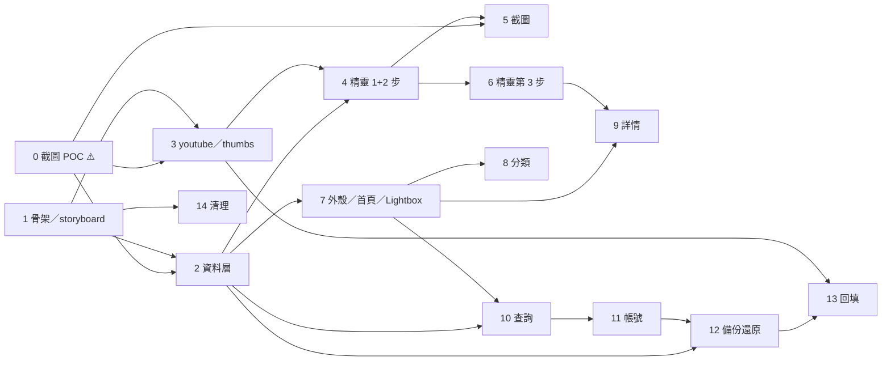

# videoshot Android · 實作計畫（路線圖）

> **For agentic workers:** 本文是路線圖。實作某個階段時，先看該階段是否已有「細節計畫」連結；
> 有的話用 superpowers:subagent-driven-development（推薦）或 superpowers:executing-plans 逐項執行；
> 沒有的話，先用 superpowers:writing-plans 為該階段產出細節計畫再動工。

**Goal:** 依規格做出 Android 原生版的 videoshot：批次取圖、年月圖庫、標籤／地點／文字檢索、Drive 備份與縮圖回填。

**Architecture:** Kotlin ＋ Jetpack Compose 單一 app，Gradle 分 `:app`（Android 相關的一切）與 `:core`（純 Kotlin 邏輯）。
資料存本機 SQLite：要備份的 `library.db` 與裝置本地的 `cache.db`；storyboard 縮圖是檔案，換機後從 YouTube 回填。沒有自有後端。

**Tech Stack:** Kotlin、Jetpack Compose、Room ＋ 自帶 SQLite（FTS5 trigram）、Android WebView、WorkManager、OkHttp、Coil、DataStore、Google Identity Services ＋ Drive REST v3。

**Spec:** [`../specs/2026-09-10-videoshot-app-design.md`](../specs/2026-09-10-videoshot-app-design.md)
**UI 驗收標準：** [`../../../mockups/uiux-v2/驗收操作手冊.md`](../../../mockups/uiux-v2/驗收操作手冊.md)（標〔app〕的條目只在 app 上驗）

## Global Constraints

每個階段、每個任務都隱含遵守以下各條（值皆取自規格原文）：

- **applicationId**：`com.xenyaa.videoshot`（OAuth client 綁定它與簽章憑證，上線後不可改）
- **minSdk 26**（Android 8.0）；語言 Kotlin；UI 一律 Jetpack Compose
- **縮圖一律 320×180 WebP q75**（storyboard 格與截圖皆同）；編碼用 `Bitmap.compress(WEBP_LOSSY, 75)`，API 29 以下用 `WEBP`
- **縮圖識別碼**：`{videoId}/L{level}/{frameIndex}`，**DB 裡不存任何檔案路徑**（規格第四節「跨平台的資料契約」）
- **`library.db` 備份、`cache.db` 不備份**；無法重建的資料一律進 `library.db`
- **檔案放 `Context.filesDir`**，不可用 `cacheDir`；`android:allowBackup="false"`
- **模組邊界**（規格第三節）：DB 只走 repo；縮圖只走 `thumbs`（畫面只呼叫 `thumbFor(shot)`）；YouTube 非官方端點只走 `youtube`；截圖藏在 `capture` 介面後；Drive 只在 `backup`
- **重運算（裁切、dHash）放 `Dispatchers.Default`**；純邏輯放 `:core`（不依賴 Android SDK）
- **commit message 用繁體中文**，格式 `類型(範圍): 描述`，不加 AI 生成標記
- **`src/lib/storyboard.ts` 在階段 14 搬進 `mockups/` 之前不得刪除**（`mockups/server.mjs:42` 執行期讀取它）

---

## 一、階段總覽

**規模基準**：S ≈ 半天～1 天，M ≈ 2～3 天，L ≈ 4 天以上。

| 階段 | 內容 | 規模 | 細節計畫 |
|---|---|---|---|
| **0** | **截圖 POC** ＋ 開發環境 ＋ 其他待實測項目 ⚠️ 出口閘門 | M | ✅ 完成（2026-09-13） |
| **1** | Gradle 骨架（`:app` ＋ `:core`）＋ storyboard 移植 | M | ✅ 完成 |
| **2** | 資料層：Room、`library.db`、`cache.db`、FTS5、repo | L | ✅ 完成 |
| 3 | `youtube` 模組、`thumbs` 模組、dHash | L | 待產出 |
| 4 | 取圖精靈第一、二步（含播放器、收斂） | L | 待產出 |
| 5 | 截圖與相簿選圖 | M | 待產出（依 POC 結果） |
| 6 | 取圖精靈第三步、完成、草稿 | L | 待產出 |
| 7 | App 外殼、首頁、Lightbox | L | 待產出 |
| 8 | 分類資料夾 | M | 待產出 |
| 9 | 詳情頁 | M | 待產出 |
| 10 | 查詢（facet、規則式、FTS／LIKE、Gemini） | L | 待產出 |
| 11 | 帳號頁、設定、標籤管理 | M | 待產出 |
| 12 | Google Drive 備份與還原 | L | 待產出 |
| 13 | 縮圖回填 | M | 待產出 |
| 14 | 清理 web 程式碼 | S | 待產出 |

細節計畫只為「即將動工、且前置結論已確定」的階段撰寫 —— 階段 0 的 POC 結果會改變階段 2、3、5、13 的做法，
提前寫到程式碼層級只會白寫。

---

## 二、各階段任務與驗收

驗收欄引用**驗收手冊**（以「手冊 §」標示）與**規格第十三節的測試案例編號**（以「案例 N」標示）。

### 階段 0 —— 截圖 POC ⚠️ 出口閘門

細節見 [階段 0 計畫](2026-09-11-階段0-截圖POC.md)。

| # | 任務 | 驗收 |
|---|---|---|
| T0.1 | 開發環境：Android Studio、SDK、手機 USB 偵錯 | `adb devices` 列出實機 |
| T0.2 | POC 專案骨架（`poc/android-capture/`） | 範本裝得上實機 |
| T0.3 | POC 程式碼：watch page、InnerTube（P-3）、JS canvas（P-1）、PixelCopy（P-2）、FTS5 trigram 與 `VACUUM INTO` | 裝得上實機，【FTS5】冒煙測試有輸出 |
| T0.4～T0.7 | 依測試矩陣實測：watch page／InnerTube／FTS5、P-1、P-2、黑畫面門檻，記入 `RESULTS.md` | 規格第十二節的矩陣全部有結果 |
| T0.8 | 依通過標準判定結論，使用者確認 | 結論段落每一項都有定案 |
| T0.9 | 結果寫回規格、解除對應的 ⏳、刪除 POC 程式碼 | 規格第十六節的 POC 相關列全部移除或改為定案 |

**出口閘門**：T0.9 未完成，不得開始階段 2、3、5、13 的細節計畫。階段 1 不受影響，可與階段 0 平行。

### 階段 1 —— Gradle 骨架與 storyboard 移植

細節見 [階段 1 計畫](2026-09-11-階段1-骨架與storyboard.md)。

| # | 任務 | 驗收 |
|---|---|---|
| T1.1 | `android/` Gradle 專案（Compose 範本），CLAUDE.md 補上建置指令 | `assembleDebug` 成功，裝得上實機 |
| T1.2 | `:core` 模組 ＋ storyboard spec 解析 | `:core:test` 通過；案例與 `src/lib/storyboard.test.ts` 對得上 |
| T1.3 | `pickLevel`、`frameIndexAt`、`framePosition`、`frameAt`、`frameTimeSec`、`sheetUrl` | `:core:test` 通過 |

### 階段 2 —— 資料層

細節見 [階段 2 計畫](2026-09-13-階段2-資料層.md)。該計畫把 T2.5 拆成讀取與寫入兩個任務，原 T2.6 順延為 T2.7。

| # | 任務 | 規模 | 驗收 |
|---|---|---|---|
| T2.1 | Room ＋ POC 選定的 SQLite 驅動；`library.db` 與 `cache.db` 兩個 database 類別；**依賴注入方式（Hilt 或手動）於此定案並寫回規格第三節** | M | 兩個檔案都建在 `filesDir`；規格第十六節「依賴注入」列解除 |
| T2.2 | `library.db` 實體：`video`／`shot`／`shot_image`／`tag`／`shot_tag`／`folder`／`shot_folder`，索引與 `(video_id, frame_index)` 唯一索引 | M | 與規格第四節逐欄位對得上；**沒有任何路徑欄位** |
| T2.3 | `shot_fts`（FTS5 trigram，原生 SQL 建表 ＋ 觸發器同步 `description`／`place`） | M | ≥ 3 字關鍵字 MATCH 命中；< 3 字走 `LIKE` 命中 |
| T2.4 | `cache.db` 實體：`thumb_state`、`draft` | S | 與規格第四節對得上 |
| T2.5 | repo 介面與實作；每次寫入 `library.db` 更新「上次變更時間」（DataStore） | M | repo 單元測試（in-memory）；`repo` 之外沒有任何 DAO 呼叫 |
| T2.6 | migrations 基礎：schema 匯出、版本號、`PRAGMA user_version` 讀取 | S | 可偵測「備份 schema 比 app 新」 |

### 階段 3 —— `youtube`、`thumbs`、dHash

| # | 任務 | 規模 | 驗收 |
|---|---|---|---|
| T3.1 | watch page 抓取 ＋ `ytInitialPlayerResponse` 擷取 ＋ metadata 對應 | M | 用錄製的頁面做單元測試；欄位依 POC 結果 |
| T3.2 | 失敗分類：`ok`／`video_unavailable`／`no_storyboard`／`parse_failed`／`fetch_failed`，`LOGIN_REQUIRED` 一律 `video_unavailable` | M | 每一類各有一份錄製頁面的測試 |
| T3.3 | （僅在 POC P-3 為正面時）InnerTube 用戶端，供回填使用 | S | 同一支影片兩條路徑得到相同 spec |
| T3.4 | `thumbs`：sheet 下載至 `drafts/{videoId}/sheets/`、裁切、WebP、寫 `thumbs/`；`thumbFor(shot)` 含缺圖（封面）與無法取回（預留圖） | L | 同一格不重複寫；手動圖從 `shot_image` 讀 |
| T3.5 | `:core` dHash：9×8 灰階 → 64-bit；漢明距離 | S | 同一畫面距離 0；明顯不同場景 > 20 |
| T3.6 | `:core` 收斂演算法：依時間序掃描、每組留最早一張、門檻高 ≤10／中 ≤6／低 ≤3 | S | 強度高 > 中 > 低的隱藏張數（案例 6） |

### 階段 4 —— 取圖精靈第一、二步

| # | 任務 | 規模 | 驗收 |
|---|---|---|---|
| T4.1 | 精靈外殼：無底部導覽、左上【✕】、三段進度帶文字、已完成步驟可點回、返回鍵 | M | 手冊 §四全流程前三條 |
| T4.2 | `:core` 網址解析（`youtu.be`、`watch?v=`、`&t=`、`shorts/`、純 videoId） | S | 案例 1；手冊 §四第一步「亂打網址」 |
| T4.3 | 第一步：最近取過的影片清單、各種錯誤情況（含無網路、`LOGIN_REQUIRED`） | M | 手冊 §四第一步；規格第五節第一步的表 |
| T4.4 | 播放器元件（WebView）＋ `Player` 介面（`seekTo`／`currentTime`／`pause`）＋ 測試用 `FakePlayer` | M | 依 POC 結論的載入方式；`FakePlayer` 供之後所有儀器測試使用 |
| T4.5 | 縮圖牆：L3 每列 3 張、讀本機 sheet、收到一張畫一張、L2 降級提示、403 → 重抓 spec → 封面 | L | 案例 2、14、16 |
| T4.6 | 互動：點＝勾選、長按 0.5s＝跳播＋震動 15ms、右上 ▶、已收藏格提示、一次性提示 | M | 案例 3、15；手冊 §四第二步 ▶ 與已收藏兩條 |
| T4.7 | 收斂：背景計算、狀態列文案、【顯示全部】／【重新過濾】、強度讀設定 | M | 案例 5、6；手冊 §四第二步前三條 |
| T4.8 | 工具列（全部選取／截圖／只看已選）與底部單列 | S | 案例 4；手冊 §四第二步「換行不截斷」「底部只有一列」 |
| T4.9 | 【✕】離開確認（保留草稿並離開／捨棄草稿） | S | 手冊 §四全流程第四條 |
| T4.10 | **效能閘門**：Android 中階實機 ＋ 4G 節流，「進入第二步 → 收斂完成」p75 | S | 見 R-3 |

### 階段 5 —— 截圖與相簿選圖

| # | 任務 | 規模 | 驗收 |
|---|---|---|---|
| T5.1 | `capture` 介面 ＋ POC 選定的實作（JS canvas 或 PixelCopy）；暫停 → 截圖 → 讀秒數 → 繼續播 | M | 案例 7 前半；手冊 §四第二步〔app〕截圖條目 |
| T5.2 | 黑畫面判定（POC 訂的門檻）與廣告偵測 → 「這一格截不到」＋【從相簿選】 | S | 案例 7 後半 |
| T5.3 | 相簿選圖（Photo Picker）＋ ±1 秒微調；POC 判定不可行時【截圖】換成【從相簿選】 | S | 手冊 §四第二步〔app〕相簿條目 |
| T5.4 | 手動圖存 `drafts/{videoId}/manual/`，以已勾選狀態插入縮圖牆對應位置並帶「截圖」標記 | S | 案例 7 |

### 階段 6 —— 取圖精靈第三步、完成、草稿

| # | 任務 | 規模 | 驗收 |
|---|---|---|---|
| T6.1 | 4 欄網格、綠點、快捷列（全選／全不選／反選／未填的） | M | 案例 11 |
| T6.2 | 抽屜：時間（中性說明）／地點／標籤／描述、`〈多個值〉`、既有值建議 | M | 案例 10；手冊 §四第三步時間欄位 |
| T6.3 | `:core` 套用語意：只套用動過的欄位、標籤整組覆蓋 | S | 案例 8、9（純函式單元測試） |
| T6.4 | 主按鈕情境切換 ＋「將更新：…」提示行 ＋ 底部單一 dock | M | 手冊 §四第三步 dock、主按鈕、提示行三條 |
| T6.5 | 完成：`library.db` transaction → `cache.db` → 刪草稿 → 標記有變更 → 回首頁捲到月份 ＋ toast | M | 案例 12；手冊 §四第三步最後一條 |
| T6.6 | 草稿存取與續做詢問（續做時重抓 watch page） | M | 案例 13 |

### 階段 7 —— App 外殼、首頁、Lightbox

| # | 任務 | 規模 | 驗收 |
|---|---|---|---|
| T7.1 | 底部導覽五格（取圖只用顏色區分）、淺色／深色主題、間距與字級尺標、平板 ≥ 600dp 加欄。**同時刪掉 `MainActivity` 裡階段 2 留下的臨時資料層冒煙畫面** | M | 手冊 §零 |
| T7.2 | 首頁：年月分組固定三欄、keyset 50 筆、月份標籤列（橫向捲動）、日曆篩選與可清除狀態列、懸浮時間軸 | L | 手冊 §二 |
| T7.3 | Lightbox：不透明、第 N / 共 M 張、左右滑動、一次性提示 | M | 手冊 §三前三條 |
| T7.4 | Lightbox 動作分層：【播放這一段】、加入分類、分享（`ACTION_SEND`）、`⋯` 內編輯與刪除 | M | 手冊 §三第四條；案例 17 |
| T7.5 | 刪除單張的連動（`shot_tag`、`shot_folder`、`shot_image`、縮圖檔、`thumb_state`、最後一張刪 `video`） | S | 案例 23 |

### 階段 8 —— 分類資料夾

| # | 任務 | 規模 | 驗收 |
|---|---|---|---|
| T8.1 | 資料夾 CRUD：樹狀、深度 5、同層不重名、名稱上限 50 | M | 案例 22 |
| T8.2 | 清單頁：含子孫計數、預覽拼貼（最多 4 張）、篩選 ＋ 四種排序、`⋯`、空狀態 | M | 手冊 §六；案例 20 |
| T8.3 | 資料夾頁（上半子資料夾、下半本層圖）＋ Lightbox【加入分類】bottom sheet | M | 案例 20 |
| T8.4 | 刪除資料夾（連子資料夾與關聯，圖不動） | S | 案例 21 |

### 階段 9 —— 詳情頁

| # | 任務 | 規模 | 驗收 |
|---|---|---|---|
| T9.1 | 播放器從 `at_sec` 開始、目前這張的圖資 ＋【編輯這張的圖資】 | M | 手冊 §七第一條 |
| T9.2 | 收藏網格：點＝跳播、編輯鈕／長按＝就地編輯（與 Lightbox 共用元件） | M | 手冊 §七第二條 |
| T9.3 | `⋯`：繼續取這支的圖／批次編輯圖資（複用第三步）／刪除整支收藏 | M | 案例 18、19 |

**依賴**：T9.3 的批次編輯直接複用階段 6 的第三步畫面，**不另做一套**。

### 階段 10 —— 查詢

| # | 任務 | 規模 | 驗收 |
|---|---|---|---|
| T10.1 | facet：時間範圍內 `GROUP BY place`／`tag_id`，地點與標籤混排、帶張數與打勾、top-30 ＋ 顯示更多 | M | 手冊 §五第二條 |
| T10.2 | 條件與結果同頁、按鈕文字與停用原因、結果列、從首頁月份標籤帶入 | M | 手冊 §五其餘條目 |
| T10.3 | `:core` 規則式解析（地點／標籤／別名最長比對 → 關鍵字） | M | 單元測試 |
| T10.4 | 檢索 SQL：≥ 3 字 FTS、< 3 字 `LIKE`、相關度 place > tag > 關鍵字、keyset | M | 案例 24 |
| T10.5 | Gemini 解析器（5 秒逾時、失敗退回規則式）＋「聽懂了：… [修改]」＋「（本機解析）」 | M | 手冊 §五〔app〕文字查詢條目 |

### 階段 11 —— 帳號頁、設定、標籤管理

| # | 任務 | 規模 | 驗收 |
|---|---|---|---|
| T11.1 | 漸層 hero ＋ 三格統計 ＋ 各區塊與圖示 | M | 手冊 §八前四條 |
| T11.2 | 設定：過濾相似強度、AI 分析區間（顯示但不生效）存 DataStore；儲存用量 | S | 手冊 §八「設定值真的存得住」 |
| T11.3 | Gemini 金鑰輸入／清除（Keystore 加密） | S | 手冊 §八〔app〕金鑰條目 |
| T11.4 | 標籤管理：改名（同名即合併）、改 kind、aliases、刪除（只解除關聯） | M | 改名與刪除後查詢輪播即時反映 |

### 階段 12 —— Google Drive 備份與還原

| # | 任務 | 規模 | 驗收 |
|---|---|---|---|
| T12.1 | Google Cloud 專案、OAuth 同意畫面發佈到 Production、Android OAuth client（**debug 與 release 的 SHA-1 都登記**）、Drive API | S | 使用者操作；見 R-6 |
| T12.2 | `AuthorizationClient` 取得 `drive.appdata`；`BackupStore` 介面、Drive 實作、`FakeBackupStore` | M | 授權畫面只要求 app 專用資料 |
| T12.3 | 備份：`VACUUM INTO` → gzip → SHA-256 → 可續傳上傳 → `appProperties` → 保留 3 份 | M | 手冊 §一〔app〕備份條目 |
| T12.4 | 觸發：WorkManager 每日（不計費網路、電量不低、有變更、> 24h）＋【立即備份】 | S | 手冊 §一 自動備份條目 |
| T12.5 | 還原：清單 → 確認框 → 驗證（SHA-256、`integrity_check`、schema 版本）→ 改名換檔 → migrations → 清 `cache.db` 與草稿 | L | 案例 25、26、27 |
| T12.6 | 首次開啟的【從 Google Drive 還原】／【全新開始】；帳號頁的連結／中斷連結 | M | 手冊 §一 |
| T12.7 | 確認同一 Cloud 專案不同 OAuth client 是否共用 appDataFolder，結果寫回規格 | S | 規格第十六節對應列解除 |

### 階段 13 —— 縮圖回填

| # | 任務 | 規模 | 驗收 |
|---|---|---|---|
| T13.1 | 掃描缺圖寫 `thumb_state`；依影片分組；只下載有收藏格子的 sheet；層級不存在時以 `at_sec` 重新定位、寫回原路徑 | M | 案例 28 |
| T13.2 | WorkManager 作業鏈；螢幕上缺圖的格子插隊 | M | 首頁捲到缺圖處會優先補上 |
| T13.3 | 節流與退避；遇 429／機器人驗證整批暫停 | S | 見 R-4 |
| T13.4 | 預設只在 Wi-Fi；【用行動網路繼續】單次授權 | S | 手冊 §一 回填條目 |
| T13.5 | `lost` 狀態、預留圖、帳號頁「無法取回 N 張」＋【稍後重試】【刪除這些收藏】 | S | 手冊 §一 無法取回條目；案例 29 |

### 階段 14 —— 清理 web 程式碼

| # | 任務 | 規模 | 驗收 |
|---|---|---|---|
| T14.1 | `src/lib/storyboard.ts` 搬進 `mockups/shared/`，改 `mockups/server.mjs` 的讀取路徑 | S | `pnpm mock` 照常開啟，縮圖探測頁正常 |
| T14.2 | 刪除 `src/`、`tests/`、`static/`、`svelte.config.js`、`vite.config.ts`、`playwright.config.ts`、`tsconfig.json`；`package.json` 只留 `mock` 腳本與其必要相依 | S | `pnpm install && pnpm mock` 正常；repo 內 grep 不到 SvelteKit 殘留 |
| T14.3 | CLAUDE.md「不能刪的東西」與 README 同步更新 | S | 文件不再提及 `src/` |

**時機**：與其他階段無依賴，**階段 1 完成後任何時候都可做**；建議早做，減少新舊程式碼並存的混淆。

---

## 三、依賴關係

**可平行的線**（階段 2、3 完成後）：

| 線 | 內容 | 說明 |
|---|---|---|
| A（主線） | 4 → 5 → 6 | 取圖精靈，最核心 |
| B | 7 → 8 ／ 7 → 10 → 11 | 瀏覽、策展、查詢；首頁可先用種子資料開發 |
| C | 12 → 13 | 備份與回填；卡在 11 的帳號頁殼 |

**交會點**：階段 9 的【批次編輯圖資】複用階段 6 的第三步畫面 —— **階段 6 必須早於階段 9**。
階段 7 的 Lightbox 與階段 9 共用就地編輯元件，先做的那個負責抽出來。

---

## 四、風險

### R-1 截圖不可行（階段 0）

**風險**：JS canvas 與 PixelCopy 都截不到影片畫面（黑畫面或被 taint）。
**判定時機**：T0.8 實測。
**退路**：只提供相簿選圖；【截圖】按鈕換成【從相簿選】並說明原因（規格第五節）。精靈其餘部分不受影響。

### R-2 自帶 SQLite 沒有 FTS5 trigram（階段 0）

**判定時機**：T0.7。
**退路**：改用 `requery/sqlite-android`（自帶較新的 SQLite 與 FTS5）；Room 改接該驅動。只影響階段 2 的 T2.1。

### R-3 第二步收斂的效能（階段 4）

**判定時機**：T4.10。**量測**：Android 中階實機 ＋ 4G 節流，短（~5 分）、中（~15 分）、長（~25 分）三支影片各跑 5 次，取 p75。

| p75 | 動作 |
|---|---|
| ≤ 3 秒 | 維持進場即收斂 |
| 3～5 秒 | 維持，但狀態列「正在過濾相似畫面…」要明確可見 |
| **> 5 秒** | **退回按鈕觸發式**（【過濾相似】、只比對已勾選的）；手冊 §四第二步前三條改寫 |

### R-4 YouTube 限流或機器人驗證（階段 3、13）

**風險**：回填時連續抓數百支 watch page，被回 429 或「確認你不是機器人」。
**判定時機**：T13.3 以 50 支以上影片的真實回填量測。
**退路**：拉長間隔、整批暫停與退避；若 POC P-3 顯示 InnerTube 可用，改走流量較小的 JSON 端點。

### R-5 YouTube 的 embed 限制影響播放本身（階段 0、4、9）

**風險**：這不只是截圖問題 —— 取圖第二步與詳情頁的**播放器本身**也是 WebView 載入 YouTube。
若 embed 對 app 回錯誤（無 referrer、影片禁止嵌入），播放器就放不出來。
**判定時機**：T0.5 的「禁止嵌入」影片與 embed 載入方式，於 T0.8 定案。
**退路**：播放器改載 `m.youtube.com` 並注入 CSS 隱藏介面（POC 同時驗證這條路）。

### R-6 OAuth 與簽章憑證（階段 12）

**風險**：OAuth client 綁定 applicationId 與簽章憑證的 SHA-1；debug 與 release 憑證不同，只登記一個時另一個版本的 Drive 授權必定失敗。
**處理**：T12.1 兩個都登記；release 憑證的 keystore 另行妥善保存（遺失等於換 app 身分）。

### R-7 storyboard／watch page 改版（全程）

規格第七節已處理（降級不當機）。計畫面的要求：**階段 3 的失敗分類必須有錄製頁面的測試覆蓋**，不能等到回填時才發現。

---

## 五、明確不做

見規格第十五節「明確排除」：第四步 AI（v2）、兩台裝置雙向合併、桌機、iOS（未排入）、Chrome 擴充功能（未排入，見規格第十八節）、
從 YouTube app 分享接收（v2）、資料夾搬移、整片掃描、向量搜尋、健康探測與告警。

**視覺回歸測試**：v1 不做（規格第十三節）。

---

## 六、驗收操作手冊的更新（✅ 已與本計畫同時完成）

手冊已改寫為 app 版的目標狀態：

| 節 | 變動 |
|---|---|
| 開頭 | 移除兩段歷次更新說明，改為一段現況說明；新增〔app〕標記的意義 |
| §零 | 鍵盤操作改為「TalkBack ＋ 實體鍵盤」；平板寬度改為 600dp |
| §一 | 「登入」整節改寫為「備份與還原〔app〕」 |
| §二 | 縮圖可聚焦的條目改為不依賴 HTML 的寫法 |
| §四 | 【手動補圖】改為【截圖】；新增截圖、截圖失敗、相簿微調、無網路、年齡限制等〔app〕條目；時間欄位的中性說明解除 ⏳ |
| §五 | 新增文字查詢的三條〔app〕條目 |
| §八 | 【登出】改為【中斷連結】；新增備份、縮圖、查詢三個區塊的圖示；新增 Gemini 金鑰條目 |
| §九 | R2 的描述改為本機縮圖；403 降級改為「先重抓 spec 再退回封面」 |
