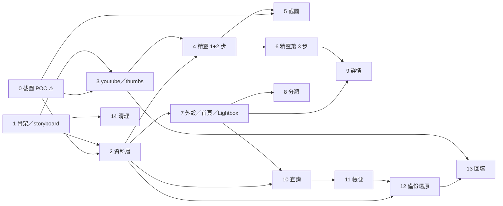

# videoshot Android · 實作計畫（路線圖）

> **For agentic workers:** 本文是路線圖。實作某個階段時，先看該階段是否已有「細節計畫」連結；
> 有的話用 superpowers:subagent-driven-development（推薦）或 superpowers:executing-plans 逐項執行；
> 沒有的話，先用 superpowers:writing-plans 為該階段產出細節計畫再動工。

**Goal:** 依規格做出 Android 原生版的 videoshot：批次取圖、年月圖庫、標籤／地點／文字檢索、Drive 備份與縮圖回填。

**Architecture:** Kotlin ＋ Jetpack Compose 單一 app，Gradle 分 `:app`（Android 相關的一切）與 `:core`（純 Kotlin 邏輯）。
資料存本機 SQLite：要備份的 `library.db` 與裝置本地的 `cache.db`；storyboard 縮圖是檔案，換機後從 YouTube 回填。沒有自有後端。

**Tech Stack:** Kotlin、Jetpack Compose、Room ＋ 自帶 SQLite（FTS5 trigram）、Android WebView、WorkManager、OkHttp、Coil、DataStore、Google Identity Services ＋ Drive REST v3。

**Spec:** [`../specs/2026-09-10-videoshot-app-design.md`](../specs/2026-09-10-videoshot-app-design.md)
**UI 驗收標準：** [`../../../mockups/uiux-v2/驗收操作手冊.md`](../../../mockups/uiux-v2/驗收操作手冊.md)（標〔app〕的條目只在 app 上驗）

## Global Constraints

每個階段、每個任務都隱含遵守以下各條（值皆取自規格原文）：

- **applicationId**：`com.xenyaa.videoshot`（OAuth client 綁定它與簽章憑證，上線後不可改）
- **minSdk 26**（Android 8.0）；語言 Kotlin；UI 一律 Jetpack Compose
- **縮圖一律 320×180 WebP q75**（storyboard 格與截圖皆同）；編碼用 `Bitmap.compress(WEBP_LOSSY, 75)`，API 29 以下用 `WEBP`
- **縮圖識別碼**：`{videoId}/L{level}/{frameIndex}`，**DB 裡不存任何檔案路徑**（規格第四節「跨平台的資料契約」）
- **`library.db` 備份、`cache.db` 不備份**；無法重建的資料一律進 `library.db`
- **檔案放 `Context.filesDir`**，不可用 `cacheDir`；`android:allowBackup="false"`
- **模組邊界**（規格第三節）：DB 只走 repo；縮圖只走 `thumbs`（畫面只呼叫 `thumbFor(shot)`）；YouTube 非官方端點只走 `youtube`；截圖藏在 `capture` 介面後；Drive 只在 `backup`
- **重運算（裁切、dHash）放 `Dispatchers.Default`**；純邏輯放 `:core`（不依賴 Android SDK）
- **commit message 用繁體中文**，格式 `類型(範圍): 描述`，不加 AI 生成標記
- **`mockups/shared/storyboard.ts` 不得刪除**（`mockups/server.mjs` 執行期讀取它；階段 14 已由 `src/lib/` 搬入）

---

## 一、階段總覽

**規模基準**：S ≈ 半天～1 天，M ≈ 2～3 天，L ≈ 4 天以上。

**完成度**＝該階段任務的完成度平均（已取消的任務不計入分母）；細節見各階段任務表的「完成度」欄。

| 階段 | 內容 | 規模 | 完成度 | 細節計畫 |
|---|---|---|---|---|
| **0** | **截圖 POC** ＋ 開發環境 ＋ 其他待實測項目 ⚠️ 出口閘門 | M | 100% | 完成（2026-09-13） |
| **1** | Gradle 骨架（`:app` ＋ `:core`）＋ storyboard 移植 | M | 100% | 完成 |
| **2** | 資料層：Room、`library.db`、`cache.db`、FTS5、repo | L | 100% | 完成 |
| **3** | `youtube` 模組、`thumbs` 模組、dHash | L | 100% | 完成（T3.3 因 POC 否定結果刪除，不計入平均） |
| **4** | 取圖精靈第一、二步（含播放器、收斂） | L | 100% | 完成（4a／4b／4c 三份細節計畫） |
| 5 | 截圖與相簿選圖 | M | — | 已併入階段 4c |
| **6** | 取圖精靈第三步、完成、草稿 | L | 100% | 完成（三套測試全綠，儀器測試已在實機跑過，見 [階段 6 計畫](2026-09-15-階段6-第三步完成與草稿.md)） |
| **7** | App 外殼、首頁、Lightbox | L | 100% | 完成（見 [階段 7 計畫](2026-09-16-階段7-外殼首頁lightbox.md)） |
| **8** | 分類資料夾 | M | 100% | 完成（見 [階段 8 計畫](2026-09-18-階段8-分類資料夾.md)） |
| **9** | **詳情頁** | M | 100% | 完成（見 [階段 9 計畫](2026-09-24-階段9-詳情頁.md)） |
| **10** | **查詢**（facet、規則式、FTS／LIKE、Gemini） | L | 100% | 完成（見 [階段 10 計畫](2026-09-24-階段10-查詢.md)） |
| **11** | **帳號頁、設定、標籤管理** | M | 98% | 完成，僅 T11.2 部分手冊條目待手動複驗（見 [階段 11 計畫](2026-09-27-階段11-帳號頁設定標籤管理.md)） |
| **12** | **Google Drive 備份與還原** | L | 100% | 完成並實機驗收（見 [階段 12 計畫](2026-09-27-階段12-google-drive備份與還原.md)） |
| **13** | **縮圖回填** | M | 100% | 完成並實機驗收（見 [階段 13 計畫](2026-09-28-階段13-縮圖回填.md)）；全分支最終審查修正 1 個 Critical＋6 個 Important，實機驗收另修 1 個純行動網路時掃描不會跑的缺口 |
| **14** | **清理 web 程式碼** | S | 100% | 完成（2026-09-30，無細節計畫） |
| **15** | **UI 對齊原型**（15A 共用元件層與驗收工具 ✅／15B 取圖精靈 ✅／15C 首頁、Lightbox、詳情、資料夾內容 ✅／15D 查詢、分類、帳號 ✅） | L | 100% | 15A 完成（見 [階段 15A 計畫](2026-10-01-階段15A-共用元件層與驗收工具.md)）、15B 完成（見 [階段 15B 計畫](2026-10-02-階段15B-取圖精靈對齊原型.md)）、15C 完成（見 [階段 15C 計畫](2026-10-03-階段15C-瀏覽動線對齊原型.md)）、15D 完成（見 [階段 15D 計畫](2026-10-03-階段15D-查詢分類帳號對齊原型.md)）；階段 15 於 2026-10-03 完成，設計文件的有效結論已併入規格第三節「UI 元件層」與第六節「UI 與原型的差異」 |
| **16** | **百萬張規模**（16A 地點表與統計表 ✅／16B 畫面改讀統計表 ✅／16C 地點管理與合併 ✅） | L | 100% | 16A、16B、16C 完成（見 [16A](2026-10-07-階段16A-地點表與統計表.md)、[16B](2026-10-07-階段16B-畫面改讀統計表.md)、[16C](2026-10-07-階段16C-地點管理與合併.md)） |

細節計畫只為「即將動工、且前置結論已確定」的階段撰寫 —— 階段 0 的 POC 結果會改變階段 2、3、5、13 的做法，
提前寫到程式碼層級只會白寫。

---

## 二、各階段任務與驗收

每個階段的任務表統一用四欄描述驗收狀態，取代舊版「驗收」欄裡條件與狀態混寫的寫法：

| 欄位 | 意義 | 是否隨進度變動 |
|---|---|---|
| **驗收條件** | 判斷過不過的標準——引用**驗收手冊**章節（「手冊 §」）、**規格第十三節的測試案例編號**（「案例 N」），或直接寫死的判斷式 | 幾乎不變 |
| **完成度** | 100%＝全部做完＋規格／手冊要求的驗收都驗過；90%＝功能與邏輯完成、JVM 測試綠燈，但還欠上機收尾；50%＝核心邏輯完成但有子項刻意延後；0%＝未開工 | 隨進度更新 |
| **上機驗證** | **已上機**（androidTest 真的用 `am instrument` 跑過，或手冊要求的操作在實機走過）／**手動已驗**（沒有 androidTest，照手冊在實機手動操作驗過）／**只編譯未跑**（androidTest 存在但只確認編譯過，沒真的在裝置上執行——這是最容易被誤判成完成的地雷格）／**不適用**（純 `:core` 邏輯或 JVM／Robolectric 測試已足夠佐證，不需要裝置；任務被取消時寫「不適用（已刪除）」）／**未細分**（階段 0～8 尚未建立這個追蹤習慣前的舊記錄，沒有個別任務層級的實機資訊，只知道當時整體測試綠燈） | 隨進度更新 |
| **備註** | 缺什麼、留到之後的範圍、已知偏離等簡短說明 | 隨進度更新 |

### 階段 0 —— 截圖 POC ⚠️ 出口閘門

細節見 [階段 0 計畫](2026-09-11-階段0-截圖POC.md)。

| # | 任務 | 驗收條件 | 完成度 | 上機驗證 | 備註 |
|---|---|---|---|---|---|
| T0.1 | 開發環境：Android Studio、SDK、手機 USB 偵錯 | `adb devices` 列出實機 | 100% | 已上機 | - |
| T0.2 | POC 專案骨架（`poc/android-capture/`） | 範本裝得上實機 | 100% | 已上機 | - |
| T0.3 | POC 程式碼：watch page、InnerTube（P-3）、JS canvas（P-1）、PixelCopy（P-2）、FTS5 trigram 與 `VACUUM INTO` | 裝得上實機，【FTS5】冒煙測試有輸出 | 100% | 已上機 | - |
| T0.4～T0.7 | 依測試矩陣實測：watch page／InnerTube／FTS5、P-1、P-2、黑畫面門檻，記入 `RESULTS.md` | 規格第十二節的矩陣全部有結果 | 100% | 已上機 | - |
| T0.8 | 依通過標準判定結論，使用者確認 | 結論段落每一項都有定案 | 100% | 不適用 | 決策／文件工作 |
| T0.9 | 結果寫回規格、解除對應的 ⏳、刪除 POC 程式碼 | 規格第十六節的 POC 相關列全部移除或改為定案 | 100% | 不適用 | 文件工作 |

**出口閘門**：T0.9 未完成，不得開始階段 2、3、5、13 的細節計畫。階段 1 不受影響，可與階段 0 平行。

### 階段 1 —— Gradle 骨架與 storyboard 移植

細節見 [階段 1 計畫](2026-09-11-階段1-骨架與storyboard.md)。

| # | 任務 | 驗收條件 | 完成度 | 上機驗證 | 備註 |
|---|---|---|---|---|---|
| T1.1 | `android/` Gradle 專案（Compose 範本），CLAUDE.md 補上建置指令 | `assembleDebug` 成功，裝得上實機 | 100% | 已上機 | - |
| T1.2 | `:core` 模組 ＋ storyboard spec 解析 | `:core:test` 通過；案例與 `src/lib/storyboard.test.ts` 對得上 | 100% | 不適用 | 純 `:core` JVM 測試 |
| T1.3 | `pickLevel`、`frameIndexAt`、`framePosition`、`frameAt`、`frameTimeSec`、`sheetUrl` | `:core:test` 通過 | 100% | 不適用 | 純 `:core` JVM 測試 |

### 階段 2 —— 資料層

細節見 [階段 2 計畫](2026-09-13-階段2-資料層.md)。該計畫把 T2.5 拆成讀取與寫入兩個任務，原 T2.6 順延為 T2.7。

| # | 任務 | 規模 | 驗收條件 | 完成度 | 上機驗證 | 備註 |
|---|---|---|---|---|---|---|
| T2.1 | Room ＋ POC 選定的 SQLite 驅動；`library.db` 與 `cache.db` 兩個 database 類別；**依賴注入方式（Hilt 或手動）於此定案並寫回規格第三節** | M | 兩個檔案都建在 `filesDir`；規格第十六節「依賴注入」列解除 | 100% | 未細分 | 階段 0～8 舊記錄，無個別任務層級的實機資訊 |
| T2.2 | `library.db` 實體：`video`／`shot`／`shot_image`／`tag`／`shot_tag`／`folder`／`shot_folder`，索引與 `(video_id, frame_index)` 唯一索引 | M | 與規格第四節逐欄位對得上；**沒有任何路徑欄位** | 100% | 未細分 | 同上 |
| T2.3 | `shot_fts`（FTS5 trigram，原生 SQL 建表 ＋ 觸發器同步 `description`／`place`） | M | ≥ 3 字關鍵字 MATCH 命中；< 3 字走 `LIKE` 命中 | 100% | 未細分 | 同上 |
| T2.4 | `cache.db` 實體：`thumb_state`、`draft` | S | 與規格第四節對得上 | 100% | 未細分 | 同上 |
| T2.5 | repo 介面與實作；每次寫入 `library.db` 更新「上次變更時間」（DataStore） | M | repo 單元測試（in-memory）；`repo` 之外沒有任何 DAO 呼叫 | 100% | 未細分 | 同上 |
| T2.6 | migrations 基礎：schema 匯出、版本號、`PRAGMA user_version` 讀取 | S | 可偵測「備份 schema 比 app 新」 | 100% | 未細分 | 同上 |

### 階段 3 —— `youtube`、`thumbs`、dHash

細節見 [階段 3 計畫](2026-09-13-階段3-youtube-thumbs-dhash.md)。**T3.3（InnerTube 用戶端）依 POC P-3 的否定結果刪除**；T3.1 拆成 `:core` 解析與 `:app` HTTP，T3.4 拆成讀取端與寫入端。

| # | 任務 | 規模 | 驗收條件 | 完成度 | 上機驗證 | 備註 |
|---|---|---|---|---|---|---|
| T3.1 | watch page 抓取 ＋ `ytInitialPlayerResponse` 擷取 ＋ metadata 對應 | M | 用錄製的頁面做單元測試；欄位依 POC 結果 | 100% | 未細分 | - |
| T3.2 | 失敗分類：`ok`／`video_unavailable`／`no_storyboard`／`parse_failed`／`fetch_failed`，`LOGIN_REQUIRED` 一律 `video_unavailable` | M | 每一類各有一份錄製頁面的測試 | 100% | 未細分 | - |
| T3.3 | （僅在 POC P-3 為正面時）InnerTube 用戶端，供回填使用 | S | 同一支影片兩條路徑得到相同 spec | 不適用（已刪除） | 不適用 | POC P-3 結果為負，本任務已刪除，不執行 |
| T3.4 | `thumbs`：sheet 下載至 `drafts/{videoId}/sheets/`、裁切、WebP、寫 `thumbs/`；`thumbFor(shot)` 含缺圖（封面）與無法取回（預留圖） | L | 同一格不重複寫；手動圖從 `shot_image` 讀 | 100% | 未細分 | - |
| T3.5 | `:core` dHash：9×8 灰階 → 64-bit；漢明距離 | S | 同一畫面距離 0；明顯不同場景 > 20 | 100% | 不適用 | 純 `:core` 邏輯 |
| T3.6 | `:core` 收斂演算法：依時間序掃描、每組留最早一張、門檻高 ≤10／中 ≤6／低 ≤3 | S | 強度高 > 中 > 低的隱藏張數（案例 6） | 100% | 不適用 | 純 `:core` 邏輯 |

### 階段 4 —— 取圖精靈第一、二步

**拆成三份細節計畫**（10 個任務、第一個有 UI 的階段，單一計畫過大）：

| 計畫 | 涵蓋 |
|---|---|
| [階段 4a](2026-09-13-階段4a-精靈外殼與第一步.md) | T4.1～T4.4、T4.9 |
| [階段 4b](2026-09-14-階段4b-縮圖牆與收斂.md) | T4.5～T4.7，以及 T4.8 的【全部選取】與【只看已選】。另外把 app 的啟動入口從階段 2 的資料層冒煙畫面換成精靈 —— 沒有這一步，第二步在實機上到不了 |
| [階段 4c](2026-09-15-階段4c-截圖與效能閘門.md) ✅ | T4.8 的【截圖】整條（`capture` 介面、JS canvas、黑畫面判定、廣告偵測、相簿退路）與 T4.10 效能閘門。**原本的階段 5 已併入這一份** |

【截圖】之所以自成一份：它是一個完整的子系統，而且規格第十二節還掛著兩個 ⏳ 未驗證的前提；
抽開之後 4b 就是一份能獨立驗收的「挑圖體驗」。

| # | 任務 | 規模 | 驗收條件 | 完成度 | 上機驗證 | 備註 |
|---|---|---|---|---|---|---|
| T4.1 | 精靈外殼：無底部導覽、左上【✕】、三段進度帶文字、已完成步驟可點回、返回鍵 | M | 手冊 §四全流程前三條 | 100% | 未細分 | - |
| T4.2 | `:core` 網址解析（`youtu.be`、`watch?v=`、`&t=`、`shorts/`、純 videoId） | S | 案例 1；手冊 §四第一步「亂打網址」 | 100% | 不適用 | 純 `:core` 邏輯 |
| T4.3 | 第一步：最近取過的影片清單、各種錯誤情況（含無網路、`LOGIN_REQUIRED`） | M | 手冊 §四第一步；規格第五節第一步的表 | 100% | 未細分 | - |
| T4.4 | 播放器元件（WebView）＋ `Player` 介面（`seekTo`／`currentTime`／`pause`）＋ 測試用 `FakePlayer` | M | 依 POC 結論的載入方式；`FakePlayer` 供之後所有儀器測試使用 | 100% | 未細分 | - |
| T4.5 | 縮圖牆：L3 每列 3 張、讀本機 sheet、收到一張畫一張、L2 降級提示、403 → 重抓 spec → 封面 | L | 案例 2、14、16 | 100% | 未細分 | - |
| T4.6 | 互動：點＝勾選、長按 0.5s＝跳播＋震動 15ms、右上 ▶、已收藏格提示、一次性提示 | M | 案例 3、15；手冊 §四第二步 ▶ 與已收藏兩條 | 100% | 未細分 | - |
| T4.7 | 收斂：背景計算、狀態列文案、【顯示全部】／【重新過濾】、強度讀設定 | M | 案例 5、6；手冊 §四第二步前三條 | 100% | 未細分 | - |
| T4.8 | 工具列（全部選取／截圖／只看已選）與底部單列 | S | 案例 4；手冊 §四第二步「換行不截斷」「底部只有一列」 | 100% | 未細分 | - |
| T4.9 | 【✕】離開確認（保留草稿並離開／捨棄草稿） | S | 手冊 §四全流程第四條 | 100% | 未細分 | - |
| T4.10 | **效能閘門**：「進入第二步 → 收斂完成」p75 | S | [量測結果](2026-09-15-階段4c-效能量測.md) | 100% | 已上機 | 2026-09-15 實測 p75 約 1 秒，維持進場即收斂 |

### 階段 5 —— （已併入階段 4c）

**2026-09-15 合併。** 原本的 T5.1～T5.4 與階段 4c 的「T4.8【截圖】整條」幾乎完全重疊 ——
同一個子系統被排了兩次。【截圖】是一個完整的子系統，切兩半沒有意義，
全部在 [階段 4c](2026-09-15-階段4c-截圖與效能閘門.md) 做完。

**後續階段不重新編號**（階段 6 仍叫階段 6），避免既有文件的交叉引用一起失效。

### 階段 6 —— 取圖精靈第三步、完成、草稿 ✅

細節見 [階段 6 計畫](2026-09-15-階段6-第三步完成與草稿.md)。**三套測試全綠**（2026-09-16）：
`:core:test` 104、`:app:testDebugUnitTest` 231（共 335 JVM）、`:app:connectedDebugAndroidTest` 100（實機）。
本階段新增的 `LocalSheetCropperTest`（7）與 `LibraryRepoWriteTest`（16）都已在實機上執行，
`SheetHarvesterTest`（9）與 `StoryboardFrameSourceTest`（12）也證實沒有被本階段的重構弄壞。

| # | 任務 | 規模 | 驗收條件 | 完成度 | 上機驗證 | 備註 |
|---|---|---|---|---|---|---|
| T6.1 | 4 欄網格、綠點、快捷列（全選／全不選／反選／未填的） | M | 案例 11 | 100% | 未細分 | - |
| T6.2 | 抽屜：時間（中性說明）／地點／標籤／描述、`〈多個值〉`、既有值建議 | M | 案例 10；手冊 §四第三步時間欄位 | 100% | 未細分 | - |
| T6.3 | `:core` 套用語意：只套用動過的欄位、標籤整組覆蓋 | S | 案例 8、9（純函式單元測試） | 100% | 不適用 | 純函式單元測試 |
| T6.4 | 主按鈕情境切換 ＋「將更新：…」提示行 ＋ 底部單一 dock | M | 手冊 §四第三步 dock、主按鈕、提示行三條 | 100% | 未細分 | - |
| T6.5 | 完成：`library.db` transaction → `cache.db` → 刪草稿 → 標記有變更 → 回首頁捲到月份 ＋ toast | M | 案例 12；手冊 §四第三步最後一條 | 100% | 已上機 | `LibraryRepoWriteTest`（16 個案例）2026-09-16 已在實機跑過；「導回首頁→捲到月份」已隨 T7.2 接上 |
| T6.6 | 草稿存取與續做詢問（續做時重抓 watch page） | M | 案例 13 | 100% | 未細分 | - |

### 階段 7 —— App 外殼、首頁、Lightbox ✅

細節見 [階段 7 計畫](2026-09-16-階段7-外殼首頁lightbox.md)。

| # | 任務 | 規模 | 驗收條件 | 完成度 | 上機驗證 | 備註 |
|---|---|---|---|---|---|---|
| T7.1 | 底部導覽五格（取圖只用顏色區分）、淺色／深色主題、間距與字級尺標、平板 ≥ 600dp 加欄。**同時刪掉 `MainActivity` 裡階段 2 留下的臨時資料層冒煙畫面** | M | 手冊 §零 | 100% | 已上機 | 鍵盤焦點框 2026-09-18 補上並在實機驗過；平板加欄同日驗完 |
| T7.2 | 首頁：年月分組固定三欄、keyset 50 筆、月份標籤列（橫向捲動）、日曆篩選與可清除狀態列、月份選擇器篩選 | L | 手冊 §二 | 100% | 未細分 | 原「懸浮時間軸」改為月份選擇器篩選，規格第六節已同步修訂 |
| T7.3 | Lightbox：不透明、第 N / 共 M 張、左右滑動、一次性提示 | M | 手冊 §三前三條 | 100% | 未細分 | - |
| T7.4 | Lightbox 動作分層：【播放這一段】、加入分類、分享（`ACTION_SEND`）、`⋯` 內編輯與刪除 | M | 手冊 §三第四條；案例 17 | 100% | 未細分 | - |
| T7.5 | 刪除單張的連動（`shot_tag`、`shot_folder`、`shot_image`、縮圖檔、`thumb_state`、最後一張刪 `video`） | S | 案例 23 | 100% | 未細分 | - |

### 階段 8 —— 分類資料夾 ✅

細節見 [階段 8 計畫](2026-09-18-階段8-分類資料夾.md)。該計畫把四個任務拆成 10 個，
並定案三件規格沒寫死的事（「最近加入」＝含子孫的 `MAX(added_at)`、預覽取最近加入的 4 張、
【加入分類】勾一下寫一次），已寫回規格第六節（Task 10 Step 1）。**三套測試全綠、實機驗收完成**
（2026-09-23，見 Task 10 報告）。

| # | 任務 | 規模 | 驗收條件 | 完成度 | 上機驗證 | 備註 | 對應任務 |
|---|---|---|---|---|---|---|---|
| T8.1 | 資料夾 CRUD：樹狀、深度 5、同層不重名、名稱上限 50 | M | 案例 22 | 100% | 手動已驗 | 2026-09-23 實機驗收 | Task 1、Task 3 |
| T8.2 | 清單頁：含子孫計數、預覽拼貼（最多 4 張）、篩選 ＋ 四種排序、`⋯`、空狀態 | M | 手冊 §六；案例 20 | 100% | 手動已驗 | 2026-09-23 實機驗收 | Task 2、Task 5、Task 6 |
| T8.3 | 資料夾頁（上半子資料夾、下半本層圖）＋ Lightbox【加入分類】bottom sheet | M | 案例 20 | 100% | 手動已驗 | 2026-09-23 實機驗收 | Task 4、Task 7、Task 8、Task 9 |
| T8.4 | 刪除資料夾（連子資料夾與關聯，圖不動） | S | 案例 21 | 100% | 手動已驗 | 2026-09-23 實機驗收 | Task 3（外鍵連動）、Task 6（確認框） |

### 階段 9 —— 詳情頁

| # | 任務 | 規模 | 驗收條件 | 完成度 | 上機驗證 | 備註 |
|---|---|---|---|---|---|---|
| T9.1 | 播放器從 `at_sec` 開始、目前這張的圖資 ＋【編輯這張的圖資】 | M | 手冊 §七第一條 | 100% | 已上機 | Task 1 新增的 4 個 androidTest 方法與手動操作皆已於 2026-09-24 在實機驗過 |
| T9.2 | 收藏網格：點＝跳播、編輯鈕／長按＝就地編輯（與 Lightbox 共用元件） | M | 手冊 §七第二條 | 100% | 手動已驗 | 2026-09-24 實機驗收 |
| T9.3 | `⋯`：繼續取這支的圖／批次編輯圖資（複用第三步）／刪除整支收藏 | M | 案例 18、19 | 100% | 手動已驗 | 2026-09-24 實機驗收；曾發現三鍵導覽列上 `BatchEditScreen` 按鈕被系統列遮住的 bug，已修並在實機重新確認 |

**依賴**：T9.3 的批次編輯直接複用階段 6 的第三步畫面，**不另做一套**。

### 階段 10 —— 查詢

| # | 任務 | 規模 | 驗收條件 | 完成度 | 上機驗證 | 備註 |
|---|---|---|---|---|---|---|
| T10.1 | facet：時間範圍內 `GROUP BY place`／`tag_id`，地點與標籤混排、帶張數與打勾、top-30 ＋ 顯示更多 | M | 手冊 §五第二條 | 100% | 手動已驗 | 2026-09-25 實機驗收 |
| T10.2 | 條件與結果同頁、按鈕文字與停用原因、結果列、從首頁月份標籤帶入 | M | 手冊 §五其餘條目 | 100% | 手動已驗 | 2026-09-25 實機驗收；已知偏離：標籤／地點與文字描述模式目前互斥，不能同時套用（規格提到可並用，留待之後）；批次編輯【完成】後查詢頁結果列不會自動刷新（需重新查詢，決定不在本階段修） |
| T10.3 | `:core` 規則式解析（地點／標籤／別名最長比對 → 關鍵字） | M | 單元測試 | 100% | 不適用 | 純 `:core` 邏輯 |
| T10.4 | 檢索 SQL：≥ 3 字 FTS、< 3 字 `LIKE`、相關度 place > tag > 關鍵字、keyset | M | 案例 24 | 100% | 已上機 | `SearchRepoTest.kt` 原僅編譯驗證，已於 2026-09-27 補測用 `am instrument` 在實機跑過並通過 |
| T10.5 | Gemini 解析器（5 秒逾時、失敗退回規則式）＋「聽懂了：… [修改]」＋「（本機解析）」 | M | 手冊 §五〔app〕文字查詢條目 | 100% | 已上機 | 2026-09-28 實機驗證有金鑰路徑：文字查詢「the trip we went to Kaohsiung」回「聽懂了：Kaohsiung・trip」（無「本機解析」字樣），確認真的走 Gemini。過程中第一把測試金鑰因專案額度用完（HTTP 402 RESOURCE_EXHAUSTED）一度誤判成程式碼問題，換一把有額度的金鑰後即正常，非 app 端 bug。`OkHttpGeminiClientTest.kt`／`AppSettingsTest.kt` 原僅編譯驗證，已於 2026-09-27 補測跑過；已知偏離：沒有做獨立【修改】按鈕，改用左上角返回鍵回條件畫面 |

### 階段 11 —— 帳號頁、設定、標籤管理

| # | 任務 | 規模 | 驗收條件 | 完成度 | 上機驗證 | 備註 |
|---|---|---|---|---|---|---|
| T11.1 | 漸層 hero ＋ 三格統計 ＋ 各區塊與圖示 | M | 手冊 §八前四條 | 100% | 手動已驗 | 2026-09-27 實機驗收；主題色系選擇器跟使用者確認後留到之後單獨排階段 |
| T11.2 | 設定：過濾相似強度、AI 分析區間（顯示但不生效）存 DataStore；儲存用量 | S | 手冊 §八「設定值真的存得住」 | 90% | 已上機 | `AppSettingsTest.kt` 原僅編譯驗證，已於 2026-09-27 補測跑過；「三格統計數字正確」等條目仍待手動複驗；回填進度顯示留待階段 13 |
| T11.3 | Gemini 金鑰輸入／清除（Keystore 加密） | S | 手冊 §八〔app〕金鑰條目 | 100% | 手動已驗 | 2026-09-27 實機驗收 |
| T11.4 | 標籤管理：改名（同名即合併）、改 kind、aliases、刪除（只解除關聯） | M | 改名與刪除後查詢輪播即時反映 | 100% | 已上機 | `AccountRepoTest.kt`（7 個案例）原僅編譯驗證，已於 2026-09-27 用 `am instrument` 單獨跑過 `OK (7 tests)` |

### 階段 12 —— Google Drive 備份與還原

| # | 任務 | 規模 | 驗收條件 | 完成度 | 上機驗證 | 備註 |
|---|---|---|---|---|---|---|
| T12.1 | Google Cloud 專案、OAuth 同意畫面發佈到 Production、Android OAuth client（**debug 與 release 的 SHA-1 都登記**）、Drive API | S | 使用者操作；見 R-6 | 100% | 手動已驗 | 2026-09-28 完成；release 憑證 SHA-1 待正式簽名 keystore 建好後補登記 |
| T12.2 | `AuthorizationClient` 取得 `drive.appdata`；`BackupStore` 介面、Drive 實作、`FakeBackupStore` | M | 授權畫面只要求 app 專用資料 | 100% | 手動已驗 | 2026-09-28 實機驗證：連結時 Play Services 未額外跳出 Drive 同意畫面 |
| T12.3 | 備份：`VACUUM INTO` → gzip → SHA-256 → 可續傳上傳 → `appProperties` → 保留 3 份 | M | 手冊 §一〔app〕備份條目 | 100% | 手動已驗 | 2026-09-28 實機【立即備份】驗證成功 |
| T12.4 | 觸發：WorkManager 每日（不計費網路、電量不低、有變更、> 24h）＋【立即備份】 | S | 手冊 §一 自動備份條目 | 100% | 已上機 | `DriveBackupStoreTest`／`BackupSnapshotterTest`／`RestoreManagerTest` 共 13 個 androidTest 已在實機用 `am instrument` 跑過並全過 |
| T12.5 | 還原：清單 → 確認框 → 驗證（SHA-256、`integrity_check`、schema 版本）→ 改名換檔 → migrations → 清 `cache.db` 與草稿 | L | 案例 25、26、27 | 100% | 手動已驗 | 2026-09-28 實機【從 Drive 還原】驗證成功，資料完整、連結狀態跨重啟保留 |
| T12.6 | 首次開啟的【從 Google Drive 還原】／【全新開始】；帳號頁的連結／中斷連結 | M | 手冊 §一 | 100% | 手動已驗 | 2026-09-28 實機驗證；曾有中斷連結 NPE bug（`GisGoogleAuth.unlink()` 缺 `.setScopes(...)`），已修，commit `52032c8` |
| T12.7 | 確認同一 Cloud 專案不同 OAuth client 是否共用 appDataFolder，結果寫回規格 | S | 規格第十六節對應列解除 | 100% | 手動已驗 | 2026-09-28 用 OAuth 2.0 Playground 換不同 OAuth client 實測確認：appDataFolder 以「帳號＋Cloud 專案」為界，與 OAuth client 無關 |

### 階段 13 —— 縮圖回填

| # | 任務 | 規模 | 驗收條件 | 完成度 | 上機驗證 | 備註 |
|---|---|---|---|---|---|---|
| T13.1 | 掃描缺圖寫 `thumb_state`；依影片分組；只下載有收藏格子的 sheet；層級不存在時以 `at_sec` 重新定位、寫回原路徑 | M | 案例 28 | 100% | 已上機 | `BackfillManager.scanForMissing`／`harvestAtLevel`、`SheetHarvester.harvestRelocated`；`BackfillManagerTest` 17 個 JVM 測試涵蓋，`SheetHarvesterTest`／`LibraryRepoReadTest` 等 androidTest 已於 2026-09-30 用 `am instrument` 在實機（2107113SG）跑過（`OK (210 tests)`）；`scanForMissing` 對真的種子資料在實機上驗過（真的打了一次 YouTube watch page，正確分類 `VIDEO_UNAVAILABLE`） |
| T13.2 | WorkManager 作業鏈；螢幕上缺圖的格子插隊 | M | 首頁捲到缺圖處會優先補上 | 90% | 已上機（作業鏈部分） | `BackfillWorker`（一次性作業鏈，`Continued.remaining` 觸發自我接續）與新增的 `BackfillScanWorker`（見下方 2026-09-30 實機發現）皆已實機驗證真的排出工作、真的執行；`DelegatingWorkerFactory` 跟每日備份共存。**螢幕可視格子插隊優先處理刻意沒做**（留待之後決定要不要補） |
| T13.3 | 節流與退避；遇 429／機器人驗證整批暫停 | S | 見 R-4 | 100% | 未上機 | `BackfillPolicy`（:core，退避以天為單位）＋ `FetchResult.RATE_LIMITED`／`PARSE_FAILED` 觸發整批暫停；節流間隔（影片間隔秒數）沿用 3 秒預設值，規格標記待真機量測調整，非本階段疏漏；429／機器人驗證的整批暫停行為本身未在實機遇到真的限流，無法驗證 |
| T13.4 | 預設只在 Wi-Fi；【用行動網路繼續】單次授權 | S | 手冊 §一 回填條目 | 100% | 已上機 | `scheduleBackfill(allowMobileData, replace)`；2026-09-30 實機驗證：純行動網路時工作正確卡在 `Ready: false` 等 Wi-Fi，切到 Wi-Fi 後真的執行；按鈕點擊後 job history 確認立即排出新工作並執行 |
| T13.5 | `lost` 狀態、預留圖、帳號頁「無法取回 N 張」＋【稍後重試】【刪除這些收藏】 | S | 手冊 §一 無法取回條目；案例 29 | 100% | 已上機 | `FileThumbs` 分辨 lost／還在等回填；2026-09-30 實機驗證：【稍後重試】job history 確認立即排出新工作；【刪除這些收藏】刪除後同一個 session 內帳號頁統計與首頁列表立即同步更新（不用重開 app） |

**全分支最終審查與 fix wave**：12 個程式碼任務逐一 subagent 實作與審查後，再跑一次全分支最終審查（opus）抓到 1 個 Critical（未回報的 `thumb_state` 格子讓 `BackfillWorker` 無限自我重排）＋ 6 個 Important（見 CLAUDE.md 階段 13 段落的完整清單），全部屬於「拆成多個任務後、組裝起來才會顯形」的整合性問題；派一次 fix wave 修完並經 scoped re-review 確認全部解決，另 park 3 個不影響正確性的 Minor。

**2026-09-30 實機驗收（2107113SG）**：全部 210 個 androidTest 用 `am instrument` 真的跑過並全過。手動走了完整 WorkManager 排程路徑（純行動網路卡住→切 Wi-Fi 真的執行→稍後重試→刪除這些收藏），過程中發現並修掉一個新缺口：`scanForMissing()` 原本只在受 Wi-Fi 約束的 `runBatch()` 裡執行，裝置純行動網路時 `thumb_state` 永遠是空的，帳號頁看不到任何進度、【用行動網路繼續】的顯示條件也永遠不成立——這是單元測試與全分支審查都測不到的情境。修法：新增無任何 constraint 的 `BackfillScanWorker`，開機時獨立排程。已在實機（純行動網路）重新驗證：`thumb_state` 正確填入、帳號頁正確顯示進度與按鈕。三套測試 JVM 799 個（`:core:test` 170 ＋ `:app:testDebugUnitTest` 629）全綠。

### 階段 14 —— 清理 web 程式碼

| # | 任務 | 規模 | 驗收條件 | 完成度 | 上機驗證 | 備註 |
|---|---|---|---|---|---|---|
| T14.1 | `src/lib/storyboard.ts` 搬進 `mockups/shared/`，改 `mockups/server.mjs` 的讀取路徑 | S | `pnpm mock` 照常開啟，縮圖探測頁正常 | 100% | 不適用 | 完成；乾淨重裝後 login.html 與 /shared/storyboard.js 皆 200 |
| T14.2 | 刪除 `src/`、`tests/`、`static/`、`svelte.config.js`、`vite.config.ts`、`playwright.config.ts`、`tsconfig.json`；`package.json` 只留 `mock` 腳本與其必要相依 | S | `pnpm install && pnpm mock` 正常；repo 內 grep 不到 SvelteKit 殘留 | 100% | 不適用 | 完成；`package.json` 只剩 `mock` 與 `typescript`，`pnpm-workspace.yaml` 一併刪除 |
| T14.3 | CLAUDE.md「不能刪的東西」與 README 同步更新 | S | 文件不再提及 `src/` | 100% | 不適用 | 完成 |

**時機**：與其他階段無依賴，**階段 1 完成後任何時候都可做**；建議早做，減少新舊程式碼並存的混淆。

### 階段 15 —— UI 對齊原型

設計結論（2026-10-03 併入規格後，原設計文件已刪除，內容留在 git 歷史）：規格第三節「UI 元件層」與第六節「UI 與原型的差異」。階段 1～14 把功能做完後，各畫面的視覺與原型（`mockups/uiux-v2/styles.css`）仍有落差；本階段先抽共用元件層，再分三份計畫逐畫面對齊。

| 子階段 | 內容 | 規模 | 狀態 | 細節計畫 |
|---|---|---|---|---|
| **15A** | 共用元件層（頂欄、底部導覽、標籤晶片、按鈕、列、空狀態、動作列、步驟列、底線分頁、工具列膠囊、提示卡）＋ 開發版驗收工具（元件總覽頁、假資料匯入、原型與實機對照截圖）＋ 主畫面（首頁、查詢、分類、資料夾內容、詳情、批次編輯、帳號與其子畫面）套上共用頂欄與底部導覽 | L | ✅ 完成 | [階段 15A 計畫](2026-10-01-階段15A-共用元件層與驗收工具.md) |
| **15B** | 取圖精靈（三步）對齊原型：外殼換共用頂欄與步驟條（頂欄顯示影片標題）、第一步取圖紀錄卡片列、第二步新格子樣式（已選＝主色框＋打勾、已收藏＝文字標記）、第三步縮圖區與 dock（鍵盤不蓋欄位、Enter 加標籤、已套用提示） | M | ✅ 完成 | [階段 15B 計畫](2026-10-02-階段15B-取圖精靈對齊原型.md) |
| **15C** | 首頁、Lightbox、詳情頁、資料夾內容對齊原型：正方形縮圖、月份標籤帶種類圖示、Lightbox 樣式與深色模式圖示、詳情頁圖資卡、資料夾內容麵包屑與子資料夾清單列 | L | ✅ 完成 | [階段 15C 計畫](2026-10-03-階段15C-瀏覽動線對齊原型.md) |
| **15D** | 查詢、分類、帳號對齊原型：查詢底線分頁與滿版時間下拉、標籤帶種類與張數、查詢結果縮圖正方形；分類卡片張數膠囊；帳號頁 hero 與統計卡、分組選單、六個子畫面改用新的設定頁元件組（分組、說明、單選列、步進器、下拉欄位）；階段 15 收尾（設計文件併入規格、手冊補條目） | M | ✅ 完成 | [階段 15D 計畫](2026-10-03-階段15D-查詢分類帳號對齊原型.md) |

**15A 實作期間的裁定**：步驟列每段最小高度 44dp（觸控目標下限），所以比原型鬆；假資料是 11 支影片（計畫原寫 12）；假資料的加入時間用秒，與正式資料一致。

**15A 實機驗收發現、15A 之後修掉的問題**：(1) 從 Lightbox 按【播放這一段】進詳情頁後，詳情頁一直停在「正在載入…」；(2) 由假資料匯入的 receiver 啟動的 process 再開 app，畫面白屏 90 秒以上，要強制停止後重開才正常。兩者已於 2026-10-02 查出根因並修正（commit `4832d60`：詳情頁載入完成旗標被晚到的播放器資訊蓋掉；`7e1eb2c`：MIUI 背景動畫停用造成第一幀請求被吞掉，補 `FrameStallGuard`），**15C 不再被它們擋住**，細節見 CLAUDE.md 階段 15A 段落。

### 階段 16 —— 百萬張規模

目標規模改成 100 萬張（實機量測：查詢頁候選清單 9.2 秒、標籤管理 3.7 秒）。設計決議與量測見 [階段 16A 計畫](2026-10-07-階段16A-地點表與統計表.md) 開頭與規格第四節「統計表」。

| 子階段 | 內容 | 狀態 | 細節計畫 |
|---|---|---|---|
| **16A** | `library.db` 升到 v2：地點表（`shot.place_id`）、由觸發器維護的統計表；使用者看得到的功能不變 | ✅ 完成 | [階段 16A 計畫](2026-10-07-階段16A-地點表與統計表.md) |
| **16B** | 首頁、查詢、標籤管理、帳號頁改讀統計表；Lightbox 拿掉「第 N / 共 M 張」、查詢結果「1000+ 張」、依標籤大小選查法 | ✅ 完成（2026-10-07） | [階段 16B 計畫](2026-10-07-階段16B-畫面改讀統計表.md)。實測（手機、100 萬張）：月份選單 0.014 秒、候選清單 0.007 秒、標籤管理 0.059 秒、帳號頁 0.009 秒、結果第一頁 0.023～0.059 秒；**首頁某月標籤 0.06～0.08 秒，未達 0.05 秒目標，接受**（量測庫每月 2,010 個不同標籤，真實圖庫每月只有幾十個；統計表讀取本身 0.012 秒） |
| **16C** | 地點管理與合併（合併後舊名留成別名）；標籤也有【合併到…】；合併中顯示「合併中…」 | ✅ 完成（2026-10-08） | [階段 16C 計畫](2026-10-07-階段16C-地點管理與合併.md)。實測（100 萬張）：repo 合併地點 10 萬張 2.83 秒（單次，目標 ≤ 3 秒，貼近上限）、合併大標籤 22 萬筆關聯 3.4～3.5 秒；16B 的讀取沒有退步。JVM 1043 個、儀器 256 個全過（最終修正後全部重跑）；實機合併畫面走過一次，合併中提示與別名描述查詢未在實機操作（單元／儀器測試覆蓋） |

**階段 16 驗收條件**：Task 4 的實機量測表達標（未達標者的處理見下）、全部儀器測試通過、裝置上的舊版圖庫升級後畫面與資料不變。
**16A 結果**：儀器測試全過、舊版圖庫升級後畫面與資料不變；量測表除「合併大標籤」（目標 3 秒）與「合併地點 10 萬張」（目標 2 秒）外達標。
**未達標項的處置**：
- scott 於 2026-10-07 決定：接受合併大標籤與合併地點的耗時（合併時顯示「合併中…」）；查詢候選清單依全部時間的張數排序。合併大標籤 16C 實測 3.4～3.5 秒（目標 3 秒，超過）；合併地點以 repo 層 3 秒目標量測，2.83 秒（單次樣本）達標。
- 首頁某月標籤 0.06～0.08 秒（目標 0.05 秒）：16B 執行時判定接受（量測庫每月有 2,010 個不同標籤，真實圖庫每月只有幾十個），不是 scott 的決定。
- ⏳ 約 5 千～2 萬張選取的結果張數 0.06～0.13 秒（目標 0.05 秒）：**待 scott 確認**，見規格第八節與第十六節。

---

## 三、依賴關係

```mermaid
flowchart LR
  S0["0 截圖 POC ⚠"] --> S2["2 資料層"]
  S0 --> S3["3 youtube／thumbs"]
  S0 --> S5["5 截圖"]
  S1["1 骨架／storyboard"] --> S2
  S1 --> S3
  S1 --> S14["14 清理"]
  S2 --> S4["4 精靈 1+2 步"]
  S3 --> S4
  S4 --> S5
  S4 --> S6["6 精靈第 3 步"]
  S2 --> S7["7 外殼／首頁／Lightbox"]
  S7 --> S8["8 分類"]
  S7 --> S9["9 詳情"]
  S6 --> S9
  S2 --> S10["10 查詢"]
  S7 --> S10
  S10 --> S11["11 帳號"]
  S2 --> S12["12 備份還原"]
  S11 --> S12
  S12 --> S13["13 回填"]
  S3 --> S13
```

**可平行的線**（階段 2、3 完成後）：

| 線 | 內容 | 說明 |
|---|---|---|
| A（主線） | 4 → 5 → 6 | 取圖精靈，最核心 |
| B | 7 → 8 ／ 7 → 10 → 11 | 瀏覽、策展、查詢；首頁可先用種子資料開發 |
| C | 12 → 13 | 備份與回填；卡在 11 的帳號頁殼 |

**交會點**：階段 9 的【批次編輯圖資】複用階段 6 的第三步畫面 —— **階段 6 必須早於階段 9**。
階段 7 的 Lightbox 與階段 9 共用就地編輯元件，先做的那個負責抽出來。

---

## 四、風險

### R-1 截圖不可行（階段 0）

**風險**：JS canvas 與 PixelCopy 都截不到影片畫面（黑畫面或被 taint）。
**判定時機**：T0.8 實測。
**退路**：只提供相簿選圖；【截圖】按鈕換成【從相簿選】並說明原因（規格第五節）。精靈其餘部分不受影響。

### R-2 自帶 SQLite 沒有 FTS5 trigram（階段 0）

**判定時機**：T0.7。
**退路**：改用 `requery/sqlite-android`（自帶較新的 SQLite 與 FTS5）；Room 改接該驅動。只影響階段 2 的 T2.1。

### R-3 第二步收斂的效能（階段 4）

**判定時機**：T4.10。**量測**：Android 中階實機 ＋ 4G 節流，短（~5 分）、中（~15 分）、長（~25 分）三支影片各跑 5 次，取 p75。

| p75 | 動作 |
|---|---|
| ≤ 3 秒 | 維持進場即收斂 |
| 3～5 秒 | 維持，但狀態列「正在過濾相似畫面…」要明確可見 |
| **> 5 秒** | **退回按鈕觸發式**（【過濾相似】、只比對已勾選的）；手冊 §四第二步前三條改寫 |

### R-4 YouTube 限流或機器人驗證（階段 3、13）

**風險**：回填時連續抓數百支 watch page，被回 429 或「確認你不是機器人」。
**判定時機**：T13.3 以 50 支以上影片的真實回填量測。
**退路**：拉長間隔、整批暫停與退避；若 POC P-3 顯示 InnerTube 可用，改走流量較小的 JSON 端點。

### R-5 YouTube 的 embed 限制影響播放本身（階段 0、4、9）

**風險**：這不只是截圖問題 —— 取圖第二步與詳情頁的**播放器本身**也是 WebView 載入 YouTube。
若 embed 對 app 回錯誤（無 referrer、影片禁止嵌入），播放器就放不出來。
**判定時機**：T0.5 的「禁止嵌入」影片與 embed 載入方式，於 T0.8 定案。
**退路**：播放器改載 `m.youtube.com` 並注入 CSS 隱藏介面（POC 同時驗證這條路）。

### R-6 OAuth 與簽章憑證（階段 12）

**風險**：OAuth client 綁定 applicationId 與簽章憑證的 SHA-1；debug 與 release 憑證不同，只登記一個時另一個版本的 Drive 授權必定失敗。
**處理**：T12.1 兩個都登記；release 憑證的 keystore 另行妥善保存（遺失等於換 app 身分）。

### R-7 storyboard／watch page 改版（全程）

規格第七節已處理（降級不當機）。計畫面的要求：**階段 3 的失敗分類必須有錄製頁面的測試覆蓋**，不能等到回填時才發現。

---

## 五、明確不做

見規格第十五節「明確排除」：第四步 AI（v2）、兩台裝置雙向合併、桌機、iOS（未排入）、Chrome 擴充功能（未排入，見規格第十八節）、
從 YouTube app 分享接收（v2）、資料夾搬移、整片掃描、向量搜尋、健康探測與告警。

**視覺回歸測試**：v1 不做（規格第十三節）。

---

## 六、驗收操作手冊的更新（✅ 已與本計畫同時完成）

手冊已改寫為 app 版的目標狀態：

| 節 | 變動 |
|---|---|
| 開頭 | 移除兩段歷次更新說明，改為一段現況說明；新增〔app〕標記的意義 |
| §零 | 鍵盤操作改為「TalkBack ＋ 實體鍵盤」；平板寬度改為 600dp |
| §一 | 「登入」整節改寫為「備份與還原〔app〕」 |
| §二 | 縮圖可聚焦的條目改為不依賴 HTML 的寫法 |
| §四 | 【手動補圖】改為【截圖】；新增截圖、截圖失敗、相簿微調、無網路、年齡限制等〔app〕條目；時間欄位的中性說明解除 ⏳ |
| §五 | 新增文字查詢的三條〔app〕條目 |
| §八 | 【登出】改為【中斷連結】；新增備份、縮圖、查詢三個區塊的圖示；新增 Gemini 金鑰條目 |
| §九 | R2 的描述改為本機縮圖；403 降級改為「先重抓 spec 再退回封面」 |
