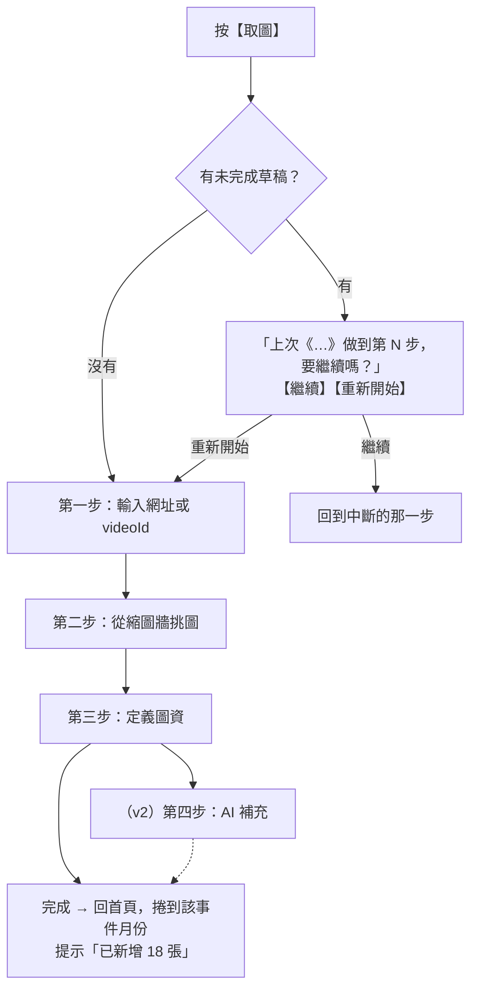
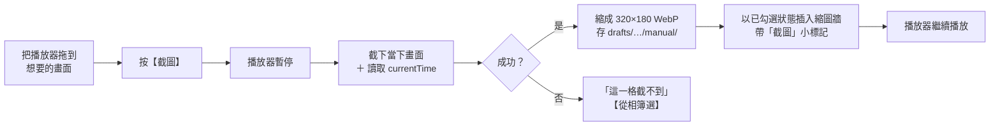
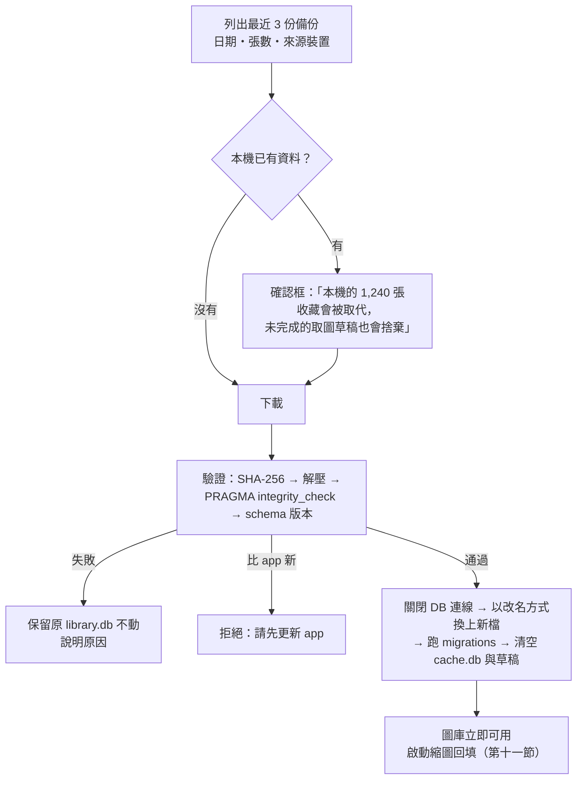

# yt-space App 設計規格書

> 從任何 YouTube 影片挑出畫面，成為可依時間瀏覽、依標籤與語意檢索的個人圖庫（Android ＋ iOS 原生 app）
> 建立日期：2026-09-10
> 狀態：**現行規格**（本文即現況，見第〇節「本文的維護方式」）

---

## 〇、本文件的定位

本文是 yt-space **唯一的現行規格**，取代 2026-08-27 的 web 版規格（SvelteKit on Cloudflare）。
那份規格、它的實作計畫（2026-09-01）與畫面契約附錄已從 `docs/` 移除，內容留在 git 歷史；
其中仍然有效的結論 —— storyboard 技術事實、取圖精靈的互動規則、資料模型、2026-09-01 的 UI 決定 —— **已全部併入本文**。

改變的是**部署形態**，不是產品：

| | web 版（2026-08-27，已取代） | 本文（2026-09-10） |
|---|---|---|
| 形態 | SvelteKit PWA ＋ Cloudflare Workers | **Flutter 原生 app**（Android ＋ iOS） |
| 資料 | D1 ＋ R2（伺服器） | **本機 SQLite ＋ 檔案**，沒有自有後端 |
| 認證 | Cloudflare Access ＋ Google | **不需要登入**；Google 帳號只用於 Drive 備份 |
| 跨裝置 | 資料在伺服器，天然同步 | **Google Drive 整包備份／還原**（換機與災難復原） |
| 手動補圖 | 使用者自己截圖、再從相簿選 | **app 內一鍵截圖**（POC 通過時），相簿選圖為退路 |
| 縮圖來源 | storyboard 經 Worker 代理 | storyboard **由 app 直接下載**（原生 app 不受 CORS 限制） |
| 文字查詢 | Gemini（伺服器持有金鑰） | **使用者自帶 Gemini 金鑰**，沒有則退回規則式解析 |

**不變的**：取圖精靈的三步流程與互動規則、`shot` 資料模型、年月縮圖牆、標籤與地點檢索、Lightbox、
分類資料夾、詳情頁，以及 [`驗收操作手冊`](../../../mockups/uiux-v2/驗收操作手冊.md) 的 UI 條目。

### 本文的維護方式

**本文永遠描述現況。** 有異動就改本文，不在頂部累積變更紀錄 ——
讀者不該先讀到過期的內容、再回頭套用一張修訂表。

- **歷史** 交給 git（`git log --follow` 這個檔案）
- **排程** 交給 [`plans/`](../plans/)：做什麼、什麼順序、驗收條件
- **本文** 只回答：要什麼、為什麼、技術事實是什麼

尚未定案的地方就地標 ⏳，第十六節另有彙總清單。

---

## 一、需求

### 1. 核心目標

把散落在 YouTube 上的影片畫面，收成**一個可以像相簿一樣瀏覽、像資料庫一樣檢索的個人圖庫**。不限於自己的影片，任何看得到的影片都能收。

### 2. 三個目標情境

**情境 A —— 依時間回顧**
打開首頁就是一面依年月分組的縮圖牆，往下滑就是往更早的時間走。想找「去年夏天」就選時間，牆面直接跳過去。

**情境 B —— 依標籤或語意找圖**
「加勒比海夜潛看到的大蝦」—— 用一句話描述，或點幾個標籤，把符合的畫面找出來。點縮圖就能跳回原影片的精確秒數播放。

**情境 C —— 一次收一整支影片**
看到一支值得收藏的影片，一趟流程走完：貼網址 → 從整支影片的縮圖裡批次挑 → 統一給它們標籤與地點 → 完成。

### 3. 功能需求

- **批次取圖**：一支影片的所有可用畫面一次攤開，勾選即收藏。
- **降噪**：連續相似的畫面進場時就先收斂掉。
- **補洞**：YouTube 沒提供的畫面，在播放器上一鍵截圖補上。
- **低成本入庫**：填資料以批次為預設，描述允許留空。
- **年月瀏覽**：首頁即圖庫，依事件日期分組。
- **標籤與語意檢索**：兩種查詢法並存。
- **秒數級回放**：點縮圖跳回原影片的該秒。
- **換機不掉資料**：備份到使用者自己的 Google Drive，新手機一鍵還原。

### 4. 產品定位

**單人、單機的個人工具。** 資料只在使用者自己的手機與自己的 Google Drive 裡，沒有任何中央伺服器持有任何人的資料。

「純本機」**不等於離線** —— 內容本體是 YouTube 影片，播放、取新圖、抓 metadata 都必須連網：

| 需要網路 | 離線可用 |
|---|---|
| 取圖精靈、播放、Gemini 查詢解析、備份與還原、縮圖回填 | 瀏覽、規則式查詢、編輯圖資、資料夾管理 |

---

## 二、技術事實

> 以下均為實際驗證過的結果（標 ⏳ 者除外）。storyboard 的部分自 web 版規格原樣保留 ——
> 它們描述的是 YouTube 的客觀行為，與部署形態無關。

### 1. YouTube Storyboard（縮圖來源）

YouTube 為進度條預覽功能，替每支影片預先產生 sprite 拼圖。**這是取得影片內真實畫面的唯一非下載途徑。**

spec 字串（watch page 的 `playerStoryboardSpecRenderer`）格式：

```
{baseURL}|{L0 spec}|{L1 spec}|{L2 spec}|{L3 spec}

每個 level spec：width#height#frameCount#cols#rows#intervalMs#nameReplacement#sigh
L3 範例：320#180#25#3#3#1000#M$M#rs$AOn4CL...
```

| 層級 | 單格尺寸 | 每張 sheet | 用途 |
|---|---|---|---|
| L2 | 160×90 | 5×5 = 25 格 | 僅在該影片沒有 L3 時降級使用 |
| **L3** | **320×180** | **3×3 = 9 格** | **本專案主力** |

**關鍵特性：總格數固定、間隔隨片長縮放。** 總格數約 100～160 格，間隔實測落在 1s / 2s / 5s / 10s 幾檔。

- 一支 3 分鐘的影片每 2 秒一張，一支 30 分鐘的影片每 12 秒一張 —— **影片越長，可挑的畫面越粗**，這正是截圖補洞要補的洞。
- **縮圖牆的張數與影片長度無關**，永遠是一兩百張；**一支影片的 L3 sheet 最多約 18 張、約 1 MB**。

定位取「最近的一格」而非「之前的一格」（對照 YouTube 播放器 hover 預覽驗證），誤差為 **±間隔/2**。
解析與定位的參考實作是 `src/lib/storyboard.ts`（`parseStoryboardSpec`、`pickLevel`、`frameAt`、`sheetUrl`），連同其單元測試移植成 Dart。

### 2. sprite 簽章的效期不可知

sprite URL 含 `sigh` 簽章。回應的 `cache-control: max-age=21600`（6 小時）是 **CDN 快取時間，不是簽章效期**。
實測同一條 URL 簽發 **70 小時後仍回 200**；竄改 `sigh` 或拿掉 `sqp` 則立即 403。
簽章實際多久失效**沒有承諾也量不出上限** → **任何需要 sheet 的時刻，都以「當下重抓 watch page 取得新 spec」為準**，不依賴存下來的舊 spec。

### 3. 原生 app 不受 CORS 限制

web 版的整套代理架構源自瀏覽器的同源政策（`i.ytimg.com/sb/`、watch page、InnerTube 都不回 CORS header）。
**原生 app 的 HTTP 請求不受同源政策約束**：watch page、sprite、InnerTube 都能直接取得，下載後的像素也能直接讀取。

代價：這些請求從使用者手機的 IP 發出，大量連續請求可能被限流或要求「確認你不是機器人」→ 批次作業必須自我節流（第十一節）。

### 4. watch page 能提供的欄位

watch page 內嵌的 `ytInitialPlayerResponse` 一次提供取圖所需的全部資料，因此**不使用 YouTube Data API**（見附錄 A-11）：

| 需要的資料 | 來源 |
|---|---|
| 可否播放 | `playabilityStatus.status`（`OK` / `UNPLAYABLE` / `LOGIN_REQUIRED` / `ERROR`…）與 `reason` |
| 標題、頻道、片長 | `videoDetails.title` / `author` / `lengthSeconds` |
| 上傳日期、是否不公開 | `microformat.playerMicroformatRenderer.publishDate` / `isUnlisted` ⏳ 欄位位置於 POC 期間以真實頁面確認 |
| storyboard spec | `storyboards.playerStoryboardSpecRenderer.spec` |
| **拍攝日期** | ❌ **沒有**。原本來自 Data API 的 `recordingDetails.recordingDate`（上傳者選填、多數為空），本版放棄 |

**失敗分類**（參考實作：`mockups/server.mjs` 的 `fetchSpec`）：

| `result` | 判斷條件 | 意義 |
|---|---|---|
| `ok` | 抓得到 spec | 正常 |
| `video_unavailable` | `playabilityStatus` 不是 `OK`，且沒有 `videoDetails` | 影片不存在、私人、已刪除、地區限制 |
| `no_storyboard` | 有 `videoDetails`，但沒有 spec | 影片本身沒有（過短、直播中、剛上傳） |
| `parse_failed` | 連 `videoDetails` 與 `playabilityStatus` 都撈不到 | **頁面結構變了，解析器失效** |
| `fetch_failed` | HTTP 非 2xx 或網路錯誤 | 環境問題 |

判定順序很重要：先確認影片能不能播，再談有沒有 storyboard。

與參考實作的一處差異：`playabilityStatus` 為 `LOGIN_REQUIRED`（年齡限制等）時，**即使有 `videoDetails` 也歸為 `video_unavailable`** ——
app 內的播放器同樣播不了，進第二步沒有意義。

### 5. 播放器畫面能不能讀

web 版：YouTube iframe 是跨來源內容，`canvas.drawImage()` 後 `toBlob()` 必定拋 `SecurityError`，**完全沒有繞法** —— 所以圖只能由使用者自己提供。

原生 app 有兩條候選路徑，**是否可行必須以實機 POC 判定**（第十二節）：

- **JS canvas**：WebView 直接載入 YouTube 頁面當**頂層文件**（不是 iframe），注入 JS 對 `<video>` 做 `drawImage`。
  YouTube 以 MSE 播放，`<video>` 的來源是頁面自建的 `blob:` URL，同源，canvas 不會被 taint。
  可拿到影片原始解析度、沒有任何 UI 疊加的畫面，秒數也取自同一個元素。
- **原生截圖**：Android `PixelCopy`、iOS `WKWebView.takeSnapshot` / `drawHierarchy`，截下後依影片區域裁切。
  已知風險：影片常位於獨立的 surface／layer，截到黑畫面；YouTube 自己的控制列、字幕、廣告在影片區域**內**，裁切去不掉。

### 6. 縮圖的實測尺寸

| | 大小 |
|---|---|
| L3 單格重新編碼為 WebP q75 | 平均 **5.9 KB**（實測 9 支影片，為 sheet 內每格的 0.96 倍） |
| 整張 L3 sheet（9 格） | 平均 54.0 KB |

換算圖庫量級：1,000 張 ≈ 6 MB、10,000 張 ≈ 60 MB、100,000 張 ≈ 600 MB。

### 7. SQLite 版本

FTS5 的 **trigram tokenizer 需要 SQLite 3.34 以上**，多數 Android 版本內建的 SQLite 比這舊 →
**必須使用自帶 SQLite 的套件**（`sqlite3_flutter_libs`），不可依賴系統 SQLite。
`VACUUM INTO`（備份快照用）需要 3.27 以上，同一個套件已滿足。

trigram 的另一個限制：**少於 3 個字元的查詢字串不會比對到任何列**（「大蝦」「露營」都是 2 個字）→ 處理方式見第八節。

### 8. Gemini 對 YouTube 影片的可及性（2026-08-07 實測）

| 隱私設定 | Gemini 可分析 |
|---|---|
| public | ✅ |
| unlisted（不公開） | ✅ 實測通過 |
| private | ❌ |

v1 不直接使用（v1 的 Gemini 只做查詢解析），但決定了 v2 第四步 AI 的可行性（第十七節）。

---

## 三、整體架構

```
Flutter app（Android + iOS）
├─ screens/         首頁・查詢・取圖精靈・分類・詳情・帳號・Lightbox
├─ services/
│   ├─ storyboard   spec 解析、pickLevel、frameAt、sheetUrl（自 storyboard.ts 移植）
│   ├─ youtube      watch page → ytInitialPlayerResponse → metadata ＋ spec ＋ 失敗分類
│   ├─ thumbs       下載 sheet → 裁切 → WebP 編碼 → 存檔；thumbFor(shot) 單一讀取入口
│   ├─ similarity   dHash（在 isolate 執行）
│   ├─ capture      截圖介面：JS canvas 實作／原生實作／相簿選圖實作
│   ├─ query        規則式解析器 ＋ Gemini 解析器（可選，失敗退回規則式）
│   ├─ backup       VACUUM INTO → Drive appDataFolder；保留 3 份；還原
│   └─ backfill     還原後的縮圖回填（Android: WorkManager；iOS: 前景）
├─ data/            repo 介面 → drift（library.db ＋ cache.db）
└─ platform         WebView（YouTube）、安全儲存、Google Sign-In
```

### 核心設計原則

1. **沒有自有後端。** app 直接對 YouTube、Google Drive、Gemini 發請求；不部署任何伺服器。
2. **單一入庫路徑。** 只有取圖精靈一個入口。
3. **不下載影片。** 所有畫面來自 storyboard 或使用者在播放器上截的圖。不碰 yt-dlp。
4. **無法重建的在 `library.db`，DB 外面的都能重建。** 這條決定了備份範圍（第十節）與檔案佈局（第四節）。
5. **影像處理在 app 內，重運算放 isolate。** 裁切、縮圖、dHash 不卡 UI 執行緒。
6. **功能降級，絕不當機。** storyboard 與 watch page 是非官方介面，必須假設它們終將改版失效。

### 模組邊界（實作時不得違反）

| # | 邊界 | 理由 |
|---|---|---|
| 1 | **所有 DB 存取只走 repo** | 測試可換 in-memory DB；schema 變動只影響一層 |
| 2 | **縮圖讀寫只走 `thumbs`**。畫面只呼叫 `thumbFor(shot)`，不知道圖是檔案裡的 storyboard 格、還是 `shot_image` 裡的手動圖 | 兩種來源、缺圖／無法取回的預留圖，都收斂在一處 |
| 3 | **所有對 YouTube 非官方端點的存取只走 `youtube`** | YouTube 改版時只修一個模組 |
| 4 | **截圖實作藏在 `capture` 介面後面** | POC 的結果只決定介面後面接哪個實作，不影響精靈的畫面 |
| 5 | **Google Drive 只在 `backup` 裡用**；`backup` 以 `BackupStore` 介面存取 Drive | 測試可用假的 BackupStore |

### 專案結構

Flutter 專案放在根目錄的 **`app/`**。

```
yt-space/
├── app/                      # Flutter app（本規格的實作）
│   ├── lib/
│   │   ├── screens/
│   │   ├── services/
│   │   ├── data/             # repo、drift schema、migrations
│   │   └── platform/
│   ├── test/                 # 單元測試
│   ├── integration_test/     # 整合測試（假播放器、錄製的 watch page）
│   ├── android/  ios/
│   └── codemagic.yaml
├── mockups/                  # UI 原型（驗收基準），pnpm mock
└── docs/superpowers/
```

web 版程式碼（`src/`、`tests/`、`static/` 與 SvelteKit／Vite／Playwright 設定）在實作計畫的清理階段**一次刪除**。
刪除前必須先把 `src/lib/storyboard.ts` 搬進 `mockups/` —— `mockups/server.mjs:42` 在執行期讀取它，刪了 `pnpm mock` 就開不起來。

### 技術選型

| 模組 | 技術 | 說明 |
|---|---|---|
| 框架 | Flutter（stable） | 選型理由見附錄 A-2 |
| 狀態管理 | ⏳ 實作計畫階段 1 選定（Riverpod 為預設候選） | — |
| 資料庫 | drift ＋ `sqlite3_flutter_libs` | 自帶 SQLite，含 FTS5 trigram（第二節第 7 點） |
| WebView | `flutter_inappwebview` | 需要：頂層載入 YouTube、注入 JS／CSS、自訂 header；⏳ POC 驗證 |
| 背景作業 | `workmanager`（僅 Android） | iOS 背景執行不可靠，回填在前景做 |
| Google 登入／Drive | `google_sign_in` ＋ `googleapis`（Drive v3） | scope 只要 `drive.appdata` |
| 金鑰儲存 | `flutter_secure_storage` | Android Keystore／iOS Keychain |
| WebP 編碼 | `flutter_image_compress` | Flutter 本身沒有 WebP 編碼器；⏳ POC P-3 驗證，不可行則改存 JPEG |
| 相簿選圖 | `image_picker` | 截圖失敗時的退路 |
| 分享 | `share_plus` | 系統原生分享面板 |
| 設定值 | `shared_preferences` | 裝置本地，不進備份 |
| 測試 | `flutter_test`、`integration_test` | 見第十三節 |
| iOS 建置 | **Codemagic**（雲端 macOS） | 開發環境是 Windows，沒有 Mac；見第十四節 |
| 圖表 | Mermaid | 版控友善 |

---

## 四、資料模型

### 兩個 SQLite 檔

| 檔案 | 內容 | 備份 |
|---|---|---|
| **`library.db`** | 無法重建的東西：影片、shot、標籤、資料夾、**手動補圖的圖片** | ✅ 整個檔案 |
| **`cache.db`** | 這台裝置自己的狀態：縮圖回填進度、精靈草稿 | ❌ |

**為什麼要拆**：縮圖在不在是**每台裝置各自不同**的事實。若把「縮圖 OK」存進 `library.db`，它會跟著備份到 B 手機，
但 B 上根本還沒有那張圖。拆開之後，B 還原時 `cache.db` 是空的，回填作業掃一遍缺哪些就好。

> **欄位命名規則沿用：凡是由 AI 產生或輔助的欄位，一律加 `ai_` 前綴。**

### `library.db`

```
video ── 被取過圖的 YouTube 影片（不一定屬於使用者）
  ├─ id              YouTube Video ID，即網址裡的 11 碼（PK）
  ├─ title           影片標題（watch page videoDetails.title），唯讀
  ├─ channel_title   頻道名稱（videoDetails.author），唯讀
  ├─ published_at    上傳日期（microformat.publishDate），必定有值
  ├─ duration_sec    片長（videoDetails.lengthSeconds），截圖時間的上限與 v2 AI 區間裁切
  ├─ privacy         'public' | 'unlisted' | 'unknown'
  ├─ sb_spec         最近一次取得的 storyboard spec JSON；簽章可能已過期，
  │                  需要 sheet 時一律重抓 watch page（第二節第 2 點）；抓不到時為 null
  └─ added_at        第一次對這支影片取圖的時間

shot ── 使用者從影片挑出的單一畫面（本系統的第一級公民）
  ├─ id              自動遞增整數（PK）
  ├─ video_id        → video.id
  ├─ at_sec          ★ 這張圖在影片的第幾秒（唯一的時間軸欄位）
  ├─ source          'storyboard'（storyboard 裁出）| 'manual'（截圖或相簿選圖）
  ├─ frame_index     storyboard 的第幾格，用於去重；manual 為 null
  ├─ sb_level        storyboard 圖所用的層級（3 或降級時的 2/1）；manual 為 null
  ├─ event_date      ★ 事件發生日期，首頁年月分組的依據；預設 = video.published_at，可改
  ├─ place           ★ 地點，獨立欄位（非標籤）
  ├─ description     使用者手寫的描述；允許留空，是全文檢索的主要素材
  ├─ ai_transcript   （v2）AI 聽到的語音內容；v1 恆為 null
  ├─ ai_visual_desc  （v2）AI 看到的畫面描述；v1 恆為 null
  ├─ ai_raw          （v2）AI 原始輸出 JSON 快照；v1 恆為 null
  └─ created_at      入庫時間

shot_image ── 手動補圖的圖片本體（只有 source='manual' 的 shot 有）
  ├─ shot_id         → shot.id（PK）
  └─ webp            320×180 WebP BLOB，約 6 KB

tag ── 標籤與暱稱（人／動物／主題；地點是 shot.place，不在此）
  ├─ id              自動遞增整數（PK）
  ├─ name            顯示名，如 "小橘" / "露營"；唯一
  ├─ kind            'person' | 'pet' | 'topic' | 'other'
  └─ aliases         別名 JSON 陣列，如 ["我家的貓","橘貓"]；檢索時視同 name

shot_tag ── shot 與 tag 的多對多
  ├─ shot_id / tag_id
  └─ source          'human'（v1 唯一值）；v2 加 'ai'（AI 推測、待人工確認）

folder ── 使用者自訂的分類資料夾（樹狀）
  ├─ id              自動遞增整數（PK）
  ├─ parent_id       上層 → folder.id；根層為 null；深度上限 5 層
  ├─ name            同一層內不可重名，長度上限 50
  └─ created_at

shot_folder ── shot 與 folder 的多對多（一張圖可同時放進多個資料夾）
  ├─ shot_id / folder_id（PK 為兩者組合）
  └─ added_at        資料夾內預設排序＝新加入在前

shot_fts ── FTS5 虛擬表（tokenizer = trigram）
  └─ 索引 description + place（v2 追加 ai_transcript + ai_visual_desc）
```

**`shot_image` 獨立成表**：讓 `shot` 每列保持很小，首頁清單的掃描不被 6 KB 的 BLOB 拖慢。

**id 用自動遞增整數**：還原是整包覆蓋、不做合併（第十節），不會有兩台裝置各自產生 id 的衝突，不需要 UUID。

**`event_date` 的預設值一律是 `published_at`**（watch page 沒有拍攝日期）。因為永遠是上傳日，
第三步的時間欄位用**中性說明**呈現即可（第五節），不需要警告色。

### `cache.db`

```
thumb_state ── storyboard 縮圖在這台裝置上的狀態
  ├─ video_id / sb_level / frame_index（PK 為三者組合）
  ├─ state           'missing'（待回填）| 'ok' | 'lost'（無法取回）
  ├─ attempts        回填失敗次數
  ├─ next_try_at     下次重試時間（退避）
  └─ lost_reason     'video_unavailable' | 'no_storyboard' | 'retries_exhausted'

draft ── 取圖精靈草稿（只有一列：最近一支）
  ├─ video_id
  ├─ step            1 | 2 | 3
  ├─ payload         JSON：已勾選的 frame_index、手動補圖清單（檔名 ＋ at_sec）、
  │                  第三步已套用的圖資、每格的 dHash 指紋（8 bytes/格）
  └─ updated_at
```

### 檔案佈局

```
<app 正式資料目錄>/          # Android: filesDir；iOS: Application Support —— 不可用系統快取目錄
├── library.db
├── cache.db
├── thumbs/{videoId}/L{level}/{frameIndex}.webp    # storyboard 縮圖；永不淘汰
└── drafts/{videoId}/
    ├── sheets/M{n}.jpg                             # 取圖用的 sheet，綁在草稿上
    └── manual/{uuid}.webp                          # 尚未完成入庫的手動補圖
```

- **不可放在系統快取目錄**：iOS 的 Caches 與 Android 的 `cacheDir` 可能被系統或使用者的「清除快取」清空，一清就要重新回填。
- **已收藏的縮圖永遠不淘汰** —— 它們就是圖庫本身，不是快取。10,000 張約 60 MB（第二節第 6 點），沒有設容量上限的必要（附錄 A-8）。
- **sheet 綁在草稿上**：精靈完成或捨棄草稿時整個 `drafts/{videoId}/` 一起刪；回填時每支影片裁完即刪。任何時刻最多約 1 MB（附錄 A-7）。
- **系統備份一律排除**：Android 設 `android:allowBackup="false"`；iOS 對整個資料目錄（含 `library.db`）設 `isExcludedFromBackup`。
  備份機制只有一套（Drive），避免系統自動還原出一份與 Drive 不一致的資料。

### 設定值（裝置本地，不進備份）

| 項目 | 存放 |
|---|---|
| 過濾相似強度（高／中／低） | `shared_preferences` |
| AI 分析區間（往前 N 秒／往後 M 秒；v2 生效） | `shared_preferences` |
| 回填是否允許行動網路（單次授權，見第十一節） | 不存，每次詢問 |
| 上次變更時間、上次備份時間 | `shared_preferences` |
| Gemini 金鑰 | `flutter_secure_storage` |

換一台裝置，設定值回到預設、Gemini 金鑰需重新輸入 —— 對單人工具可接受，且金鑰不應出現在備份檔裡。

### 去重

`shot` 對 `(video_id, frame_index)` 建唯一索引（`frame_index` 為 null 的手動補圖不受限）。
同一支影片只用一個 storyboard 層級（該影片的最高可用層級），不混用。
重複取圖時，已收藏的格子在縮圖牆上標示「已收藏」且不可再勾選。

### 索引

- `shot(event_date, id)` —— 首頁時間軸與 keyset 分頁
- `shot(video_id)` —— 詳情頁取單片所有 shot
- `shot(place)` —— 地點篩選與 facet
- `shot_tag(tag_id)` / `shot_tag(shot_id)` —— 多對多 join
- `folder(parent_id)` —— 資料夾樹展開
- `shot_folder(folder_id, added_at)` —— 資料夾內容 keyset 分頁
- `shot_folder(shot_id)` —— 「這張圖在哪些資料夾」與刪除連動

### schema 版本

以 drift migrations 管理（`PRAGMA user_version`）。還原舊版備份時自動跑遷移；**備份的 schema 比 app 新則拒絕還原**，提示先更新 app。

### 相對 web 版的變動

| 動作 | 項目 | 理由 |
|---|---|---|
| **移除** | 所有表的 `owner_id` | 單人單機 |
| **移除** | `video.recorded_at` | watch page 沒有；不再呼叫 Data API |
| **移除** | `shot.thumb_key` | 路徑由 `(video_id, sb_level, frame_index)` 推導；手動圖改存 `shot_image` |
| **新增** | `shot.sb_level` | 推導縮圖路徑用 |
| **新增表** | `shot_image` | 手動圖無法從 YouTube 重建，必須進備份 |
| **移除表** | `facet_month_agg` | 本機幾萬筆，`GROUP BY` 即時算只要幾毫秒；彙總表只剩同步 bug 的風險 |
| **移除表** | `sb_probe` | 沒有伺服器，也沒有需要告警的管理員 |
| **新增檔** | `cache.db`（`thumb_state`、`draft`） | 裝置本地狀態不可進備份 |

---

## 五、取圖精靈（核心）

### 入口

底部導覽列五格等寬：

```
首頁 ・ 查詢 ・ 【取圖】 ・ 分類 ・ 帳號
```

【取圖】不凸出、不加大，**只用顏色與其他四格區分** —— 導覽列常疊在縮圖牆上方，凸出的按鈕會遮擋內容。

### 流程總覽



- 三個步驟都**沒有底部導覽**，左上角是【✕】。
- 頂部三段式進度指示，**帶文字**：`1. 貼網址 › 2. 挑畫面 › 3. 填資料`。已完成的步驟可點回去，支援 Android 返回鍵。
- 動詞統一：【下一步】→【下一步】→【完成】。返回上一步不會丟失該步的選擇。
- 第二／三步按【✕】→ 明確詢問「保留草稿並離開／捨棄草稿」，畫面上要說得出草稿還在不在。

> 進度指示是三段不是四段：先畫一格永遠灰著的第四步，等於每次取圖都展示一個做不到的承諾。
> 代價是 v2 加第四步時進度列要改版，已知並接受。

### 第一步：輸入網址

接受 `youtu.be/xxx`、`youtube.com/watch?v=`、帶 `&t=` 的網址、`youtube.com/shorts/`、以及純 videoId。

輸入框下方是**「最近取過的影片」清單**：影片圖示＋標題＋日期＋已取張數，**點一列直接進第二步**（不是把網址填回輸入框）。
資料直接查 `video` 表（依 `added_at` 排序，附各片 shot 數），不另存一份歷史。

按【下一步】後由 `youtube` 模組抓 watch page，一次取得可播放狀態、metadata、storyboard spec；
同時查出**該片已收藏的 `frame_index` 清單**（第二步據此標示鎖定格）。

| 情況 | 行為 |
|---|---|
| 正常 | 進第二步 |
| 解析不出 videoId | 就地顯示錯誤並說明可接受的格式，不換頁 |
| 沒有網路 | 「取圖需要網路」，不換頁 |
| `video_unavailable` 或 `LOGIN_REQUIRED`（年齡限制等） | 「這支影片抓不到，可能是私人影片、已被刪除或需要登入」 |
| `no_storyboard` | **仍然進第二步**，縮圖牆顯示空狀態，工具列只開放【截圖】 |
| `parse_failed` | 同上，並提示「無法取得逐段縮圖，可以截圖補上」 |
| 這支之前取過圖 | 正常進入，頂部提示「這支已收藏 12 張」，已收藏的格子標示且不可勾 |

### 第二步：從縮圖牆挑圖

```
┌───────────────────────────┐
│ ✕  宜蘭兩天一夜           │
│ 1.貼網址 › 2.挑畫面 › 3.填資料 │
├───────────────────────────┤
│                           │
│    YouTube 播放器         │  ← sticky 釘在頂部
│                           │
├───────────────────────────┤
│ 已收斂成 50 張候選，隱藏了 98 張相似畫面 [顯示全部] │
├───────────────────────────┤
│ 全部選取│截圖│只看已選    │  ← 工具列，換行不截斷
├───────────────────────────┤
│ ┌────┐ ┌────┐ ┌────┐      │  ← 每列 3 張
│ │   ▶│ │ ✓ ▶│ │   ▶│      │     右上 ▶ ＝ 跳去播放
│ │00:00│ │00:10│ │00:20│    │     右下小字＝影片時間
│ └────┘ └────┘ └────┘      │     紅框＝已選；藍框＝播放器停在這格
│           ⋮                │     灰＋鎖＝先前已收藏
├───────────────────────────┤
│ 50 張候選 · 已選 18   [下一步（18 張）] │  ← 只有一列，底下不疊導覽列
└───────────────────────────┘
```

#### 畫質與排列

- **L3（320×180/格）、每列 3 張。** 該影片沒有 L3 時自動降到最高可用層級（`pickLevel()`），並提示「這支影片只有較低畫質的縮圖」。
- L2 每列 5 張曾評估並否決：單格辨識度不足以支撐「挑圖」這個動作本身。

#### 載入

- **sheet 由 app 直接下載**（同時 4 張），存進 `drafts/{videoId}/sheets/`。縮圖牆**收到一張就畫一張**，
  同一份檔案同時交給 isolate 算 dHash。web 版「顯示直連 `i.ytimg.com`、計算另走代理」的雙路徑在原生 app 沒有必要。
- 定位公式（`storyboard` 模組）：

```
frameIndex  = round(t / (intervalMs / 1000))     ← 取最近的一格
perSheet    = cols * rows
sheetIndex  = floor(frameIndex / perSheet)
posInSheet  = frameIndex % perSheet
row = floor(posInSheet / cols),  col = posInSheet % cols
```

- **sheet 回 403**（簽章過期，多發生在隔很久才續做草稿）：先重抓一次 watch page 刷新 spec 再試；
  仍然 403 才**退回顯示該影片的封面圖**（`i.ytimg.com/vi/{id}/hqdefault.jpg`，無簽章、不會過期），使用者仍能靠時間標籤與播放器挑格。

#### 互動：點＝勾選，長按＝跳去播放

| 手勢 | 行為 |
|---|---|
| **點一下** | 切換勾選。整格都是點擊區 |
| **長按 0.5 秒** | 上方播放器跳到該時間點播放，該格顯示藍框，震動回饋 15ms |
| **點每格右上角的 ▶** | 同長按。長按不是唯一入口 —— 鍵盤與輔助技術到不了長按 |
| 已收藏的格子 | 點下去不會勾選，但**明確提示「這一格已經收藏過了」**；長按與 ▶ 仍可跳播 |

挑圖是主要動作，必須拿到最順、不需要瞄準的手勢。「點＝播放、小圓圈＝勾選」曾評估並否決：
96px 寬的格子上小圓圈只有約 20px，選 30 張要精準點 30 次。▶ 承載的是次要動作，點不準的代價只是沒跳播。

首次進入第二步時，在工具列下方顯示一次性提示：「點一下收藏・長按看看那一段」，點任意處消失，記在本機不再出現。

#### 收斂：進場時就已經過濾過

縮圖牆不是攤開 148 格讓使用者自己找，而是**一進第二步就收斂成候選**，把連續相似的畫面藏起來。

- 頂部狀態列：「已收斂成 50 張候選，隱藏了 98 張相似畫面」＋【顯示全部】。
  按下後 148 張全部出現，按鈕變成【重新過濾】，可以來回切。
- **強度沿用帳號頁的「取圖 › 過濾相似強度」**（高／中／低，預設中）。切換設定後，以新門檻**對原始 148 格重算**，不是在已過濾的結果上疊加。
- 演算法：每格縮到 9×8 灰階，算 **dHash**（64-bit 指紋），漢明距離小於門檻視為相似。依時間順序掃描，每組保留最早的一張。
  ⏳ 暫定門檻：高 ≤ 10、中 ≤ 6、低 ≤ 3，待實測調校。
- 在收斂算完之前，縮圖牆已經先畫出來、可以捲動與點選；狀態列顯示「正在過濾相似畫面…」。

> **效能閘門（沿用 web 版的 R-1，但風險已大幅降低）**：web 版最慢的是每張 sheet 都要繞經 Worker 代理，
> 原生 app 沒有這一跳；總量約 1 MB，148 次 dHash 在 isolate 裡是毫秒級。
> 仍以 Android 中階實機 ＋ 4G 節流實測「進入第二步 → 收斂完成」的 p75：
> **超過 5 秒就退回按鈕觸發式**（【過濾相似】按鈕、只比對已勾選的）。

#### 工具列

**【全部選取】** —— 全選／全不選切換，已收藏的格子不納入。

**【截圖】** —— 補上 YouTube 沒提供的畫面：



- 圖與秒數在同一瞬間取得（先暫停），因此**不提供 ±1 秒微調** —— 一調就對不上了。
- **失敗判定**：
  - **黑畫面**：原生截圖失敗時常靜悄悄回一張全黑的圖。像素幾乎全黑、或亮度變異極低，即判定失敗（⏳ 門檻於 POC 期間訂定）。
  - **廣告播放中**：偵測得到時停用【截圖】並說明原因。
- **相簿選圖（退路）**：時間點取播放器當下秒數，**可 ±1 秒微調**（因為秒數不是從圖來的）。
  選到的圖同樣縮成 320×180 WebP。POC 判定某平台截圖不可行時，該平台的【截圖】按鈕直接換成【從相簿選】，並說明「系統無法從播放器截圖，請提供你自己的截圖」。
- `capture` 介面的實作由 POC 決定（第十二節）。

**【只看已選】** —— 篩選顯示，方便確認最終結果。

### 第三步：定義圖資

```
┌───────────────────────────┐
│ ✕  定義圖資    18 張·8 已完成│
│ 1.貼網址 › 2.挑畫面 › 3.填資料 │
├───────────────────────────┤
│ 全選│全不選│反選│未填的     │
├───────────────────────────┤
│ ┌──┐┌──┐┌──┐┌──┐          │  ← 每列 4 張
│ │● ││● ││✓ ││✓ │          │     ● 綠點＝已套用過
│ └──┘└──┘└──┘└──┘          │     ✓ 紅框＝目前勾選中
├═══════════════════════════┤  ← 抽屜與按鈕合成同一塊 dock
│ 套用到已選的 10 張          │
│ 時間 [2025-07-12]          │
│   預設帶入 YouTube 的上傳日期，可以改成實際拍攝日 │
│ 地點 [冬山河            ]  │
│ 標籤 (玩水)(阿明)(＋)      │
│ 描述 [留空，之後 AI 補  ]  │
│ 將更新：地點、標籤　其他欄位維持各張原值 │
│ [      套用到 10 張       ] │
└───────────────────────────┘
```

進場時從本機的 sheet 裁出勾選的格子，寫入 `thumbs/`；因為 sheet 已在本機，「處理縮圖 12/18」的進度幾乎一閃而過。

#### 唯一的規則：抽屜永遠在編輯「目前勾選的那些」

沒有「批次模式」與「單張模式」的切換，因為那是同一件事：

| 勾選數 | 抽屜標題 | 行為 |
|---|---|---|
| 18（預設全選） | 套用到已選的 18 張 | 一次填完共同欄位 |
| 10 | 套用到已選的 10 張 | 第二輪不同的資料 |
| 1 | 套用到已選的 1 張 · 01:10 | 欄位直接顯示它現有的值 —— 這就是「單張編輯」 |
| 0 | 抽屜收合 | — |

#### 套用語意：蓋掉，但沒動過的欄位不套用

| 情況 | 行為 |
|---|---|
| **修改過**的欄位 | **覆蓋**勾選中每一張的該欄位（標籤亦然：整組換成抽屜裡的那組） |
| **沒碰過**的欄位 | **完全不套用**，各張維持原值 |
| 勾選多張且該欄位原值不一致 | 顯示 `〈多個值〉` 佔位字樣（紫色斜體），不動它就不會變 |

**為什麼要有「沒動過就不套用」**：第 1 輪標了「露營」、第 2 輪標了「玩水」，之後全選 18 張只想補一個「宜蘭」標籤時，
純粹的「全部蓋掉」會把露營與玩水一起洗掉。加上這條之後，「蓋掉」的單純規則仍然成立，但不會誤傷。

這條規則**要看得見**：動過欄位時，按鈕上方出現「將更新：地點、標籤　其他欄位維持各張原值」。

#### 欄位

| 欄位 | 預設值 | 說明 |
|---|---|---|
| **時間**（`event_date`） | `video.published_at` | 首頁分組的依據。欄位下方一行**中性說明**「預設帶入 YouTube 的上傳日期，可以改成實際拍攝日」，不用警告色 —— 預設值永遠是上傳日，這是常態不是例外 |
| **地點**（`place`） | 空 | 輸入時提示既有地點（`SELECT DISTINCT place`） |
| **標籤** | 空 | chip 形式，輸入時提示既有標籤與其 aliases |
| **描述**（`description`） | 空 | **允許留空**，佔位字樣「留空，之後 AI 補」 |

描述可以留空：18 張圖每張都打一段字，沒有人會做完。真正拿來檢索的是標籤與地點，它們天生適合批次。

#### 快捷列與主按鈕

- 快捷列：全選／全不選／反選／**未填的**（一鍵勾選所有沒有綠點的，收尾時用）。
- **主按鈕會變**：沒動過欄位時是【完成】；動了任一欄位就變成【套用到 N 張】。流程終點【完成】永遠是最搶眼的那一顆。

### 完成

按【完成】時若仍有未套用資料的 shot，顯示「還有 3 張沒填資料，仍要完成嗎？」——**提醒但不阻擋**。

完成後：

1. **`library.db` 一個 transaction 寫完**：`video`（首次取圖時新增）、`shot`、`shot_tag`、手動圖的 BLOB（自 `drafts/…/manual/` 搬進 `shot_image`）。
2. 在 `cache.db` 把本批 storyboard 格記為 `ok`，刪除 `drafts/{videoId}/` 與 `draft` 列。
   兩個檔案無法共用 transaction；這一步若沒做到也無妨 —— `thumb_state` 可由「縮圖檔在不在」重新推導，回填掃描會自行修正。
3. 標記「有變更」，並檢查自動備份條件（第十節）。
4. 導回首頁 → 捲到該 `event_date` 的月份 → toast「已新增 18 張」。

縮圖檔在第三步進場時就已寫好（路徑由影片、層級、格號推導）。若在 transaction 之前當掉，只會留下未被引用的檔案，
下次取到同一格時直接覆蓋，不會壞掉。

### 草稿：中途離開

- 存在 `cache.db` 的 `draft` 列 ＋ `drafts/{videoId}/` 目錄，**只記最近一支**，不進備份。
- 內容：`videoId`、步驟、已勾選的 `frame_index`、手動補圖清單、第三步已套用的圖資、dHash 指紋。
- 下次按【取圖】時詢問：「上次《宜蘭兩天一夜》做到第三步，要繼續嗎？　【繼續】【重新開始】」
- 續做時先重抓 watch page 刷新 spec（簽章可能已過期），sheet 若已被清掉就重新下載。
- 完成或【重新開始】後清除。手動圖在完成前都在草稿目錄，**捨棄草稿就是刪目錄，不會留下孤兒資料**。

> 曾評估「按下一步時就先入庫、標記為未完成」。否決：那等於把已移除的待處理佇列請回來（首頁或某處必須顯示這些未完成的圖）。

### 第四步：AI 補充（v2）

v1 不實作。第三步的【完成】在 v2 會變成【下一步】，資料表欄位已預留。規劃見第十七節。

---

## 六、首頁、查詢、Lightbox、分類、詳情

版面以 `mockups/uiux-v2/` 與驗收操作手冊為準；本節只記錄規則與資料來源。

### 首頁

- 依 `event_date` 年月分組的縮圖牆，由新到舊；**每個月份固定三欄**，不隨當月張數改變。
- **卡片上只有縮圖**，不顯示描述。
- 每月的標籤列（該月的標籤與地點，`GROUP BY` 即時算）。⏳ 目前為單行橫向捲動（沿用原型）；手冊原本要求換行排列，尚未確認。
- **預設沒有時間篩選**。右上角日曆鈕 → 選一個月份 → 出現可清除的狀態列「只顯示 ○年○月 以前的收藏 ✕」。
- immich 式懸浮時間軸。
- 縮圖是可聚焦的按鈕（鍵盤與輔助技術可操作）。
- 清單以 keyset 分頁（一次 50 筆，游標為上一頁最後一筆的 `(event_date, id)`）。
- 縮圖一律經 `thumbs.thumbFor(shot)`：缺圖時顯示影片封面，無法取回時顯示中性的預留圖（標影片秒數）。
- 手機直式為主；**平板寬度（≥ 600px）加欄**；不做桌機版面。

### Lightbox（全屏檢視器）

首頁、查詢結果、資料夾內的縮圖，點一下開啟全屏檢視器（不是直接跳詳情頁）：

- **背景不透明**，底層的月份標題與縮圖不會透出來。
- 上方顯示「第 N / 共 M 張」—— M 是目前清單的總數，本機 `COUNT` 即可取得。
- 左右滑動＝上一張／下一張，範圍是**進來時的清單**（首頁＝目前顯示中的時間軸、查詢＝該次結果、資料夾＝該資料夾本層）。
- 第一次開啟出現一次性的「左右滑動看上一張／下一張」提示。
- 大圖是 320×180 放大置中（`contain`），全屏會偏軟，這是儲存尺寸的天生限制，已接受（附錄 A-6）。
- **動作分層**：

| 層級 | 動作 | 行為 |
|---|---|---|
| 主要 | **【▶ 播放這一段】** | 導向詳情頁，播放器從 `at_sec` 開始播 |
| 圖示鈕 | 【🗂 加入分類】 | bottom sheet 列出資料夾樹（可勾多個），勾選即加入／移出，關閉即生效，可直接【＋新增資料夾】 |
| 圖示鈕 | 【分享】 | 系統分享面板，內容 `https://youtu.be/{videoId}?t={at_sec}` |
| `⋯` 選單 | 【編輯圖資】 | bottom sheet 就地編輯描述／標籤／地點／時間（與詳情頁同一個元件） |
| `⋯` 選單 | 【刪除這張收藏】 | 確認後刪除，檢視器自動滑到下一張；刪到最後一張則關閉 |

刪除不跟瀏覽動作並排。

### 查詢

- **地點與標籤混排同一條輪播**，以顏色與圖示區分：`[📍宜蘭 12] [📍冬山河 10] [⌗露營 8] [👤阿明 6] …`
  - 每個 chip **帶張數**；選取後除了變色還**多一個打勾**（不只靠顏色）。
  - 資料：時間範圍內的 `GROUP BY place` 與 `GROUP BY tag_id`，合併後依張數排序，top-30 ＋「顯示更多」。
- **條件與結果在同一頁**：選完按【查詢 N 個條件】→ 同頁換成結果，左上角返回鍵可改條件。
- 按鈕文字跟著選取數量變；停用時下方說明原因「先選一個以上的標籤或地點」。
- 結果列顯示「N 張 · 全部日期 · 條件 chips」；結果 keyset 分頁 50 筆。
- 從首頁的月份標籤點進來時，條件與時間自動帶入並直接顯示結果。
- 動作列釘在導覽列上方。
- 文字查詢見第八節；**標籤條件與文字條件可以並用**。

### 分類 `/folders`

**與標籤的分工**：tag 描述「這張圖是什麼」（檢索用的 metadata），folder 是「我要把它收在哪」（人工策展）。兩者不互相取代。

| 規則 | 內容 |
|---|---|
| 結構 | 樹狀，**深度上限 5 層**（已在第 5 層則 UI 阻擋再建子層）；同層不可重名；名稱上限 50 字 |
| 一張圖可進幾個資料夾 | 不限（多對多） |
| 清單頁卡片 | 名稱 ＋ **含子孫層**的計數（遞迴 CTE）＋ **內容預覽拼貼（最多 4 張）**；空資料夾顯示「還沒有圖片」；右下有看得見的 `⋯`（改名／刪除），長按亦可 |
| 清單頁操作 | 名稱篩選 ＋ 四種排序（名稱升／降、張數多→少、最近加入） |
| 空狀態 | 沒有任何資料夾時，空狀態帶一顆【新增資料夾】 |
| 資料夾頁 | 上半子資料夾、下半本層的圖（`added_at` 新到舊，keyset 分頁）；點圖開 Lightbox |
| 加入圖片 | **只從 Lightbox 的【加入分類】**；資料夾頁不提供挑圖介面 |
| 刪除資料夾 | 連同子資料夾與所有關聯一併刪，**圖本身不動**，確認框明示範圍 |
| 搬移（換父層）與手動排序 | v2 |

本機 SQLite 下，預覽拼貼與含子孫計數都是單次查詢的事，web 版擔心的 N+1 與彙總表問題不存在。

### 詳情 `/v/[videoId]`

- 上方播放器從 `at_sec` 開始播，**不設結束時間** —— 跳過去就繼續往下播，想停自己停。
- 播放器下方顯示**目前這一張的圖資**（描述、地點與標籤 chips、日期、影片秒數）＋【編輯這張的圖資】。
- 「這支影片的收藏」縮圖網格：點縮圖＝跳播；右上角編輯鈕或長按＝就地編輯（bottom sheet，播放器留在上方繼續播）。
- 右上角 `⋯` 三個影片層級動作：
  - **【繼續取這支的圖】** → 精靈第二步，已收藏的格子標示出來。
  - **【批次編輯圖資】** → 把這支影片所有 shot 載入**精靈第三步的同一個介面**，改完按【完成】回詳情頁。不另做一套批次編輯 UI。
  - **【刪除整支收藏】** → 確認框明示範圍：「將刪除這支影片的 12 張收藏（含 2 張截圖），YouTube 原片不受影響。」
    確認後刪除 `shot`、`shot_tag`、`shot_folder`、`shot_image`、`thumbs/{videoId}/`、`thumb_state` 相關列、`video` 列，導回首頁並 toast。
- 影片被刪或轉私人時播放器失效，但圖資與縮圖仍在，頁面不得整頁失敗。

### 刪除的一致規則

單張刪除（Lightbox 或詳情頁）做同樣的連動但只針對那一張；該影片最後一張被刪掉時，順帶刪 `video` 列。

**所有刪除都是硬刪除，不做回收桶。** 注意：storyboard 圖可從 YouTube 重新取圖恢復，**截圖不行** ——
確認框必須點明含幾張截圖。誤刪的最後防線是 Drive 上保留的 3 份備份（第十節）。

---

## 七、縮圖策略

> **命名注意**：`L0`~`L3` 是 **YouTube 定義的 storyboard 畫質層級**，是外部規格。

### 存單格，不存 sheet

| | 整張 L3 sheet | 單格 WebP q75 |
|---|---|---|
| 實測平均 | 54.0 KB / 9 格 | 5.9 KB / 格 |
| 換算門檻 | 一張 sheet 要收藏到 9.2 格才划算 —— 但一張只有 9 格 | — |

存 sheet 在儲存上永遠不會比較省；單格另外換到與手動圖統一的形態（一張圖＝一個 320×180 WebP）。

### 流程（第三步進場時）

```
1. 已有第二步下載好的 sheet（drafts/{videoId}/sheets/）
2. 以 pickLevel() 取最高可用層級，frameAt() 算出每張勾選格的 sheetIndex 與位置
3. 若 thumbs/{videoId}/L{level}/{frameIndex}.webp 已存在 → 跳過
4. 裁出該格 → WebP q75（⏳ POC P-3：不可行則 JPEG）
5. 寫檔；sheet 本身不留存（隨草稿刪除）
```

### ⚠️ 這是非官方端點

storyboard 與 watch page **沒有任何官方文件或相容性承諾**。設計上必須假設它們終將失效：

| 失敗 | 行為 |
|---|---|
| **解不出 spec**（`no_storyboard` 或 `parse_failed`） | 第一步仍可進第二步，縮圖牆空白，只開放【截圖】，提示「無法取得逐段縮圖，可以截圖補上」 |
| **spec 解得出來，但 sprite 回 403** | 重抓 watch page 一次；仍失敗則退回顯示封面圖 |

- **功能降級，絕不當機。**
- **已存進 `thumbs/` 的縮圖完全不受影響**，首頁與查詢照常運作。失效只影響新取圖與回填。
- **不做健康探測與告警。** web 版的金絲雀 probe 是為了讓管理員早於使用者知道解析器壞了；
  本機 app 沒有管理員，使用者在取圖時自然會看到上面那句功能性訊息，那就是唯一需要的表達。
  解析器修好的方式是發新版 app（`youtube` 模組是唯一需要改的地方）。

### 資產尺寸

| 資產 | 尺寸 | 位置 |
|---|---|---|
| storyboard 單格 | L3 320×180（降級時 L2 160×90），約 5.9 KB | `thumbs/{videoId}/L{level}/{frameIndex}.webp` |
| 手動補圖（截圖或相簿） | 320×180，約 6 KB | `library.db` 的 `shot_image` |

---

## 八、檢索

### 標籤與地點查詢

純 SQL，不經 AI。facet 由時間範圍內的 `GROUP BY` 即時計算（第六節查詢）。
地點條件走 `shot.place = ?`，標籤條件走 `shot_tag`。

### 文字查詢

以「加勒比海夜潛看到的大蝦」為例：

```
1. 查詢解析（query 模組，兩個實作）
   - 有 Gemini 金鑰且在線：Gemini Flash 一次輕量文字請求（逾時 5 秒）
   - 沒有金鑰、離線、逾時或錯誤：規則式解析
   → { date_from, date_to, places: ["加勒比海"], tags: ["夜潛"], keywords: ["大蝦"] }

2. facet 對應：tag 以 name 與 aliases 比對出 tag_id；place 直接字串比對

3. SQL 檢索：
   SELECT … FROM shot s
   LEFT JOIN shot_tag st ON st.shot_id = s.id
   WHERE (s.event_date <= ? OR ? IS NULL)
     AND (s.place = ? OR st.tag_id IN (?) OR <關鍵字條件>)
   ORDER BY <相關度>
```

**規則式解析**：以既有的地點與標籤（含 aliases）對輸入句做最長比對，命中者成為 place／tag 條件，
其餘字串切成關鍵字。它聽不懂「去年夏天」這類自然語言日期 —— 那是 Gemini 的增值，不是底線。

**關鍵字條件與 trigram 的限制**：

| 關鍵字長度 | 條件 |
|---|---|
| ≥ 3 個字元 | `s.id IN (SELECT rowid FROM shot_fts WHERE shot_fts MATCH ?)` |
| < 3 個字元（如「大蝦」） | `s.description LIKE '%大蝦%' OR s.place LIKE '%大蝦%'`（全表掃描；本機一萬筆為毫秒級） |

### 相關度排序

`place` 命中 > `tag` 命中 > 關鍵字命中。避免「描述裡剛好講到宜蘭」壓過「這張圖的地點就是宜蘭」。

### 顯示解析結果

文字查詢的結果列上方常駐一行「**聽懂了：加勒比海・夜潛・大蝦　[修改]**」，
讓使用者搜不到東西時能分辨是「解析錯誤」還是「圖庫裡確實沒有」。
使用規則式解析時，行尾加註「（本機解析）」。

### Gemini 的呼叫

- 金鑰由使用者在帳號頁輸入，存 `flutter_secure_storage`；app 直接呼叫 `generativelanguage.googleapis.com`，模型 `gemini-flash-latest`。
- 帳號頁說明：金鑰只用於查詢解析、只存在這台裝置、建議在 Google Cloud 把該金鑰限縮為只能呼叫 Generative Language API。
- ⏳ 解析 prompt 需實際迭代（如何穩定區分地點與標籤）。

---

## 九、帳號頁

導覽列第五格「帳號」。這裡的「帳號」是**用來備份的 Google 帳號**，不是登入 —— app 不需要登入就能用。

### 版面

沿用原型 `mockups/uiux-v2/account.html`：漸層 hero ＋ 跨在下緣的三格統計卡。

| 區塊 | 內容 |
|---|---|
| hero | 已連結 Google：名稱、Email、頭像字母；未連結：「尚未設定備份」＋【連結 Google 帳號以啟用備份】 |
| 三格統計 | 收藏張數、本月新增（`event_date` 落在本月，與首頁分組同一口徑）、來源影片數；三格都是入口 |
| **備份**（圖示：雲） | 上次備份時間與大小、【立即備份】、【從 Drive 還原】；最底為【中斷連結】（破壞性樣式） |
| **縮圖**（圖示：圖片） | 回填進度「縮圖回填中 320 / 1,200」、「無法取回 12 張」＋【稍後重試】【刪除這些收藏】、儲存用量 |
| **取圖**（圖示：漏斗） | 過濾相似強度（高／中／低） |
| **查詢**（圖示：放大鏡） | Gemini 金鑰（輸入／清除），說明金鑰用途與存放位置 |
| **AI 分析**（圖示：星芒） | 往前 N 秒／往後 M 秒；顯示但不生效，標示「第四步上線後生效」 |
| **標籤管理**（圖示：標籤） | 全部標籤 ＋ kind ＋ 使用張數；改名／改 kind／編輯 aliases／刪除 |

- 圖示對得上語意，同一個圖示不會出現在兩個不同語意的地方。
- 各細項頁的說明文字寫**這個設定會影響什麼**，不是操作教學。
- 設定值改完重開 app 仍在；換裝置回預設（第四節）。

### 標籤管理的規則

- **改名成既有名稱＝合併**：兩者的 `shot_tag` 合併到既有標籤，舊標籤刪除（確認框說明）。
- **刪除只解除關聯**，圖不會被刪。
- 改名與刪除後，查詢頁輪播與首頁標籤列即時反映（沒有彙總表，天然一致）。

---

## 十、備份與還原

同步模型是**換機與災難復原**：同一時間只有一台在用；備份是整包上傳，還原是整包覆蓋，**不做合併、不處理衝突**（其他模型見附錄 A-4）。

### 範圍

依第三節原則 4：**備份 `library.db` 一個檔案**，它已包含所有無法重建的東西（含手動補圖）。
storyboard 縮圖、`cache.db`、草稿、設定值、Gemini 金鑰都不備份。

### Google 帳號與 Drive 權限

- Google Sign-In，只要求 **`drive.appdata`**：只能存取 app 自己在 Drive 上的**隱藏資料夾**（appDataFolder），看不到使用者其他任何檔案。
  ⏳ 確認它屬於免安全審查的非敏感 scope。
- 取捨：隱藏資料夾讓使用者不會誤刪誤改備份檔，代價是在 Drive 網頁上看不到它。
- OAuth 同意畫面**必須發佈到 Production** —— 停在 Testing 狀態的 refresh token 7 天就失效，自動備份會悄悄停掉。
- **Google 連結是選用的**：不連結 app 也完整可用，只是沒有備份。

### 備份

1. `VACUUM INTO` 產生一致的快照（WAL 模式下不可直接複製 DB 檔）→ gzip → 算 SHA-256。
2. Drive **可續傳上傳**，檔名 `library-{yyyyMMdd-HHmm}.db.gz`；檔案的 `appProperties` 記錄 schema 版本、收藏張數、裝置名稱、SHA-256。
3. 上傳成功後，才刪除超過 **3 份**的舊備份。
4. 更新「上次備份時間」。失敗則保留「有變更」標記，下次再試。

### 觸發

repo 每次寫入 `library.db` 都更新「上次變更時間」。

| 觸發 | 條件 |
|---|---|
| **自動（Android）** | WorkManager 每日排程；約束：不計費網路、電量不低。有變更且距上次備份 > 24 小時才執行 |
| **自動（iOS）** | 背景排程不可靠 → app 回到前景時檢查、精靈【完成】後檢查；條件同上 ＋ 目前在 Wi-Fi |
| **手動** | 帳號頁【立即備份】；不受 Wi-Fi 與 24 小時限制 |

### 還原

入口：第一次開啟 app 的【從 Google Drive 還原】／【全新開始】，以及帳號頁的【從 Drive 還原】。



- 換檔以「寫到暫存檔、驗證完再改名」完成，中途斷線或失敗只會維持原狀，**不會留下半套資料**。
- 還原完成的當下：所有圖資、標籤、資料夾、手動補圖都已就位，首頁可以直接用；storyboard 縮圖由回填補上。

---

## 十一、縮圖回填

還原後（或任何時候發現缺圖時），把 storyboard 縮圖從 YouTube 重新抓回來。

### 流程

```
1. 掃描 library.db 所有 source='storyboard' 的 shot，檢查 thumbs/ 下檔案是否存在，
   缺的以 state='missing' 寫入 cache.db 的 thumb_state
2. 依影片分組，一次一支：
   a. youtube 模組抓 watch page → 取得新的 spec
   b. 用 shot.sb_level 定位；該層級已不存在時，以 at_sec 在最高可用層級重新定位，
      裁出的圖仍寫入原路徑 L{sb_level}/{frame_index}（DB 不改，路徑只是識別碼）
   c. 只下載「有收藏格子」的那幾張 sheet
   d. 裁切 → 寫入 thumbs/ → state='ok' → 刪除 sheet
3. 螢幕上正在顯示、但缺圖的格子，插隊優先處理
```

### 節流

- 影片與影片之間間隔數秒（⏳ 參數實測訂定）。
- 遇到 429 或「確認你不是機器人」頁面：**整批暫停**，以逐次拉長的退避稍後再試。

### 流量與網路

- watch page 經 gzip 約 250 KB／支（⏳ 估計值，POC 期間實測），加上所需的少數 sheet；500 支影片約 150 MB。
- **預設只在 Wi-Fi 下回填**。進度卡片上有【用行動網路繼續】—— 單次授權，下次再問。
- ⏳ POC P-4：若 `youtubei/v1/player` 的 JSON 回應也帶 storyboard spec，改用它可省下大部分流量。

### 平台差異

| 平台 | 執行方式 |
|---|---|
| Android | WorkManager 一次性作業鏈，約束「有網路（預設不計費網路）」；app 關閉後仍會繼續 |
| iOS | 只在 app 開著時於前景執行 |

### 狀態與失敗

| 狀態 | 顯示 | 處理 |
|---|---|---|
| `missing` | 該影片的封面圖 | 等待回填 |
| `ok` | 縮圖 | — |
| 網路錯誤 | 同 `missing` | 以退避分數天重試，超過次數轉 `lost`（`retries_exhausted`） |
| `lost` | 中性預留圖，標影片秒數 | 影片 `video_unavailable`、現在 `no_storyboard`、或重試用盡 |

帳號頁顯示回填進度與「無法取回 N 張」，提供【稍後重試】（把 `lost` 重設為 `missing`）與【刪除這些收藏】。
`lost` 的 shot 保留全部圖資，仍可被查到、被播放（若影片還能播）。

> 這一節取代了 web 版的「縮圖修復」（14A）：同一套機制同時處理「還原後補圖」與「解析器降級期間漏掉的圖」。

---

## 十二、截圖 POC

**整個實作計畫的第一步**，只為了回答「做不做得到」。POC 程式碼驗證完即丟棄，不進 `app/`。

### 要回答的問題

| # | 問題 | 驗證方式 |
|---|---|---|
| **P-1** | **JS canvas 截圖**：WebView 載入 YouTube 頁面當頂層文件，注入 `drawImage(video)`，能否拿到非黑、無任何 UI 疊加的畫面？ | 兩種載入方式：embed 頁面 ＋ 正確的 referer；`m.youtube.com` ＋ 注入 CSS 隱藏介面 |
| **P-2** | **原生截圖**（P-1 的退路）：Android `PixelCopy`、iOS `takeSnapshot` / `drawHierarchy`，是否黑畫面？YouTube 自己的控制列能否排除？ | 同一組影片 |
| **P-3** | Flutter 在兩平台能否**編碼 WebP**？320×180 實際大小？ | `flutter_image_compress` |
| **P-4** | `youtubei/v1/player` 的回應是否帶 storyboard spec？流量比 watch page 省多少？ | 回填流量的依據 |

附帶確認：watch page 的 `publishDate` / `isUnlisted` 欄位位置（第二節第 4 點）、watch page 的實際 gzip 傳輸量、黑畫面判定門檻。

### 測試矩陣

- **實機**：Android 一台、iPhone 一台（經 Codemagic 建置）。模擬器的影片解碼管線與實機不同，結果不算數。
- **影片**：一般公開、不公開（unlisted）、禁止嵌入、有廣告、Shorts。

### 通過標準與後續

以**平台為單位**判定：一般公開與不公開影片都截得到畫面、無 UI 疊加、暫停後秒數誤差 ≤ 0.1 秒。

| 結果 | `capture` 的實作 |
|---|---|
| P-1 通過 | JS canvas |
| P-1 不通過、P-2 通過 | 原生截圖 ＋ 依影片區域裁切 |
| 兩者都不通過 | 該平台只提供相簿選圖 |

結果寫回本文（第二節第 5 點、第五節【截圖】、本節），並依結果決定 `capture` 介面後面接的實作。
POC 的結論**不承諾所有影片、所有播放情境 100% 可截**；截圖失敗時的退路（相簿選圖）永遠存在。

---

## 十三、測試策略

- **單元測試**（`flutter_test`）：storyboard（移植 `src/lib/storyboard.test.ts` 的案例）、dHash、規則式查詢解析、repo（in-memory SQLite）、
  備份快照與還原驗證、回填的失敗分類。
- **整合測試**（`integration_test`，Android 模擬器）：
  - **假播放器**：可控的 `currentTime` 與截圖結果（含黑畫面），對應 web 版的 `PUBLIC_PLAYER_MODE=fake`，讓測試離線且穩定。
  - **`youtube` 模組吃錄製的 watch page 與 sheet**，不打真的 YouTube。
  - **假的 `BackupStore`** 取代 Drive。

### v1 的整合測試案例

1. 貼各種形式的網址（`youtu.be`、`watch?v=`、帶 `&t=`、`shorts/`、純 videoId）→ 都能進第二步
2. 進第二步 → 縮圖數量與 `frameCount` 一致、每格時間標籤正確
3. 點縮圖 → 勾選切換；長按與 ▶ → 播放器跳到正確秒數
4. 【全部選取】→ 已選數 = 總數（不含已收藏的）
5. 進場即收斂：狀態列文案正確；【顯示全部】／【重新過濾】可來回切
6. 過濾強度高／中／低 → 隱藏張數依序遞減；切換強度是對原始 148 格重算
7. 【截圖】→ 產生 `source='manual'` 的 shot，`at_sec` = 播放器當下秒數；假播放器回黑畫面 → 提示並提供【從相簿選】
8. 第三步勾 8 張套用 → 只有那 8 張變；再勾另外 10 張套用 → 前 8 張不受影響
9. 沒動過的欄位不被覆蓋 —— 全選後只改標籤，各張的地點與描述維持原值
10. 只勾 1 張 → 抽屜顯示該張現有的值
11. 【未填的】→ 只勾選沒有綠點的
12. 完成 → 首頁出現 N 張，且在正確的年月分組下
13. 中途離開 → 再按【取圖】出現「要繼續嗎」，選【繼續】回到原步驟與原選擇
14. 影片沒有 storyboard → 空縮圖牆 ＋ 只開放【截圖】，不當機
15. 已收藏的格子 → 鎖定，點擊出現「這一格已經收藏過了」
16. 影片只有 L2 → 縮圖牆正常並提示畫質較低，檔案路徑為 `L2`
17. Lightbox：左右滑動換張、【播放這一段】秒數正確、【刪除】後自動跳下一張
18. 【批次編輯圖資】→ 進第三步介面，改標籤後詳情頁與查詢結果同步
19. 【刪除整支收藏】→ 首頁不再出現該影片，`thumbs/{videoId}/` 與對應的 `shot_image` 一併刪除
20. 建立資料夾與子資料夾 → Lightbox【加入分類】→ 分類頁計數含子孫層
21. 刪除資料夾 → 子資料夾與關聯一併消失，圖仍在首頁
22. 已在第 5 層 → 不能再建子層
23. 刪除 shot → 它在所有資料夾中的關聯一併消失
24. 文字查詢：無金鑰 → 走規則式並標「本機解析」；2 字關鍵字（`LIKE` 路徑）仍查得到
25. **備份 → 還原到全新安裝** → 所有圖資、標籤、資料夾與截圖一致
26. 還原檔 SHA-256 不符或 `integrity_check` 失敗 → 原 `library.db` 不動
27. 還原 schema 比 app 新的備份 → 拒絕並提示更新
28. 回填：缺圖 → 以錄製資料補回；`video_unavailable` → `lost`；網路錯誤 → 排入退避重試
29. 解析器失效（watch page 結構被改）時，已存的縮圖仍正常顯示

**視覺回歸（screenshot diff）v1 不做** —— UI 仍在變動期，導入只會把時間耗在核可 baseline。

---

## 十四、成本與發佈

| 項目 | 用途 | 費用 |
|---|---|---|
| **Apple Developer Program** | iPhone 長期安裝（免費帳號簽的 app 7 天過期）、TestFlight | **US$99／年** |
| Codemagic | iOS 雲端建置（沒有 Mac） | $0（⏳ 確認免費額度，記得為每月 500 分鐘） |
| Google Play 開發者帳號 | 選用；Android 可直接安裝 APK | US$25 一次（選用） |
| Google Cloud 專案 | OAuth client、Drive API | $0 |
| Google Drive | 備份空間，使用者自己的 15 GB | $0 |
| Gemini | 使用者自帶金鑰 | 使用者自己的免費額度 |

**v1 總計：US$99／年（全部來自 iOS）。** web 版的「全程 $0」在 iOS 上不成立。

**發佈節奏的限制**：iPhone 經 TestFlight 安裝，**TestFlight 版本 90 天過期** → 至少每 90 天要經 Codemagic 重新建置一次。
解析器因 YouTube 改版失效時，修復也是走「改 `youtube` 模組 → 建置 → 發佈」這條路。

---

## 十五、範圍界定

### v1（本規格範圍）

- Flutter 原生 app，Android ＋ iOS；手機直式為主，平板加欄
- 取圖精靈三步：網址、縮圖牆挑圖（含進場收斂、截圖、相簿退路）、批次定義圖資；草稿續做
- 首頁年月縮圖牆、Lightbox、標籤／地點／文字三種查詢（Gemini 可選）
- 分類資料夾（樹狀、深度 5、預覽拼貼、篩選與排序）
- 詳情頁播放、就地編輯、影片層級的批次編輯與刪除
- 帳號頁：統計、設定、標籤管理、Gemini 金鑰
- Google Drive 備份與還原、縮圖回填
- 深色模式、鍵盤與輔助技術可操作
- 單元測試與整合測試

### 明確排除

| 項目 | 排入 | 理由 |
|---|---|---|
| **第四步 AI 補充圖資** | **v2（確定要做）** | 資料表欄位已預留，見第十七節 |
| 兩台裝置雙向合併同步 | ❌ | 同步模型選了換機與災難復原（附錄 A-4） |
| 桌機版面 | ❌ | 手機優先 |
| 從 YouTube app 分享接收 | v2 | v1 收斂為單一入口。原生 app 以 Android intent 實作成本很低，v2 優先考慮；行為應為直接跳進精靈第二步 |
| 上傳非影片畫面的實體照片 | v2 | 範圍限定為 YouTube 影片畫面；相簿選圖是例外，因為它綁定影片時間點 |
| 資料夾搬移（換父層）與手動排序 | v2 | 低頻操作 |
| 整片掃描 | v2 | 與「手動挑畫面」的產品核心不同調 |
| 向量搜尋 | v2 | FTS5 ＋ trigram 先驗證品質 |
| 本機 `.mp4` pipeline | 擱置 | 見附錄 A-10 |
| 健康探測與告警 | ❌ | 沒有伺服器與管理員（第七節） |

---

## 十六、開放項目（⏳ 彙總）

各項已在正文就地標註，此處為索引：

| 項目 | 位置 | 何時確認 |
|---|---|---|
| POC P-1～P-4 的結果 | 第十二節 | 計畫的第一個階段 |
| watch page 的 `publishDate` / `isUnlisted` 欄位位置 | 第二節第 4 點 | POC 期間 |
| WebP 編碼是否可行（否則 JPEG） | 第三節、第七節 | POC P-3 |
| 截圖黑畫面判定門檻 | 第五節 | POC 期間 |
| `drive.appdata` 是否屬於非敏感 scope | 第十節 | 備份階段開工前 |
| Codemagic 免費額度 | 第十四節 | POC 開工前（POC 就需要 iOS 建置） |
| 狀態管理套件 | 第三節 | 實作計畫階段 1 |
| dHash 三檔門檻值 | 第五節 | 收斂功能實作時以真實影片調校 |
| 回填節流參數、watch page 實際流量 | 第十一節 | 回填階段 |
| Gemini 查詢解析的 prompt | 第八節 | 查詢階段 |
| 首頁月份標籤：換行 vs 橫向捲動 | 第六節 | 暫定橫向捲動（沿用原型） |

---

## 十七、v2 藍圖：第四步 AI 補充圖資

記錄於此，避免 v1 做出擋住 v2 的設計。**不在 v1 實作範圍內。**

### 定位

第三步之後多一步：從剛入庫的 shot 中**選擇性地**挑幾張送 Gemini 分析，自動補上 `ai_visual_desc`、`ai_transcript` 與建議標籤。
選擇性是重點 —— 收了 18 張圖，可能只有 5 張值得花 AI 額度。

使用 v1 已存在的**使用者自帶 Gemini 金鑰**，app 直接呼叫；沒有金鑰時第四步不出現。

### 區間從何而來

`shot` 只有 `at_sec`。送 Gemini 時由帳號頁的兩個數字推導：

```
[max(0, at_sec - 往前N秒), min(duration_sec, at_sec + 往後M秒)]
```

### 請求規格（已實測）

```jsonc
{
  "contents": [{
    "parts": [
      { "fileData": { "fileUri": "https://youtu.be/{videoId}" },
        "videoMetadata": { "startOffset": "{start}s", "endOffset": "{end}s", "fps": 0.5 } },
      { "text": "<prompt> + 影片標題/頻道 + 使用者已填的 description 與標籤" }
    ]
  }],
  "generationConfig": {
    "mediaResolution": "MEDIA_RESOLUTION_LOW",
    "responseMimeType": "application/json",
    "responseSchema": { /* transcript, visual_desc, tags[], date_hints[] */ }
  }
}
```

實測成本：`fps: 0.5` ＋ `MEDIA_RESOLUTION_LOW` 約 **60 tokens/秒**。只適用 public 與 unlisted 影片（第二節第 8 點）。

### 必須遵守的原則

- **AI 產出永遠可覆寫**：原始輸出存 `ai_raw`，每個欄位旁提供「還原成 AI 原版」。
- **AI 產生的標籤為虛線 chip**（`shot_tag.source = 'ai'`），使用者點擊確認後轉為 `human` 並變實心。
- **不覆蓋使用者的 `description`**：AI 的描述寫進 `ai_visual_desc`，兩者並存。
- **UI 絕不假設分析會成功**：失敗時顯示具體原因，該 shot 一樣留在圖庫，只是沒有 AI 欄位。
- **重疊區間複用**：同一支影片重疊度高的區間提示「與 01:10 那張重疊 90%，直接複用？」
- **app 驅動的循序分析**，顯示進度；分析結果寫入 `library.db`，隨備份保存。

---

## 附錄 A：已評估並排除的方案

> 收錄的目的只有一個：**不要再花時間重新評估一次。** 完整推導見 git 歷史。

### A-1 web 版（SvelteKit on Cloudflare）—— 被本文取代

2026-08-27 的規格：SvelteKit PWA ＋ Workers ＋ D1 ＋ R2 ＋ Cloudflare Access，另有金絲雀 probe 與自架版（v3）藍圖。
2026-09-10 改為純 app，理由是**不經營任何伺服器**。它仍然有效的結論已併入本文；
失去的是「資料在伺服器、多裝置天然同步」，換成 Drive 整包備份（附錄 A-4）。

### A-2 Capacitor 包 Svelte —— 不採用

保留 SvelteKit（改純 SPA）包進原生殼，原型的 HTML／CSS 可直接沿用。否決：
**截圖**與**背景回填**這兩個新核心功能都是它的弱點 —— app 本身就是一個 WebView，YouTube 播放器只能以跨來源 iframe 放入，
JS 碰不到；背景 JS 能力有限，app 關閉後基本停止。而 `src/` 是 08-07 clip 版、本來就要大改，可沿用的只有樣式。

### A-3 PWA ＋ 瀏覽器內 SQLite（OPFS）—— 不採用

瀏覽器仍受 CORS 約束，watch page 與 sprite 必須經代理 → 與「沒有後端」矛盾。

### A-4 同步模型 —— 選「換機與災難復原」

| 模型 | 內容 | 結論 |
|---|---|---|
| **A. 換機與災難復原** | 同時只有一台在用；整包備份、整包覆蓋 | ✅ 採用 |
| B. 兩台都用、不同時編輯 | 整包覆蓋，還原前比對、B 較新時警告 | 不採用；使用者選 A |
| C. 兩台並用、雙向合併 | 變更日誌 ＋ 衝突規則 ＋ 壓縮；Drive v3 已移除 `etag`，沒有可靠的樂觀鎖，需 append-only journal | ❌ 工作量大一個量級 |

### A-5 備份範圍 —— 選「DB ＋ 手動補圖」

| 方案 | 結論 |
|---|---|
| 只備份 DB | ❌ 手動補圖在新手機全部遺失 |
| **DB ＋ 手動補圖**（storyboard 圖回填） | ✅ 採用。代價：影片被刪或轉私人後，其 storyboard 縮圖在新手機永久無法取回（`lost`）；需要回填機制 |
| DB ＋ 全部圖片 | 不採用。1 萬張僅約 60 MB，可省掉回填且不怕影片消失；使用者選擇以回填換取較小的備份 |

手動圖以 BLOB 存在 `library.db`，所以「DB ＋ 手動補圖」實際上就是備份一個檔案。

### A-6 截圖的儲存尺寸 —— 選 320×180

曾評估 1280×720（Lightbox 較清楚，另存 320×180 小圖給縮圖牆）與原始解析度。
選 320×180：與 storyboard 圖一致，單張約 6 KB，備份量最小。代價是 Lightbox 全屏偏軟，與 storyboard 圖相同。

### A-7 sheet 暫存的 LRU 上限 —— 不需要

曾暫定 100 MB 的 LRU，但這個數字沒有根據。sheet 只在精靈進行中、草稿存在期間、回填當下需要，
而一支影片最多約 18 張、約 1 MB，草稿只記最近一支 → 綁在草稿上、用完即刪即可，不需要上限與淘汰。

### A-8 縮圖容量上限（N GB、超過輪循覆蓋）—— 不需要

已收藏的縮圖**就是圖庫本身**，淘汰一張首頁就少一格、只能回 YouTube 重抓（還可能抓不回來）。
而 10,000 張才約 60 MB，上限永遠不會被觸發。帳號頁只顯示用量，不提供上限設定。

### A-9 Google Drive 當即時資料庫（含 DuckDB）—— ❌ 不做

2026-08-26 評估：DuckDB-wasm 送不出 auth header、且本系統是 OLTP 小查詢，引擎應是 SQLite；
Drive 無並發控制；縮圖放 Drive 無法用原生圖片載入。
本文使用 Drive 的方式不同：**只當備份檔的存放處**，資料庫永遠在本機，上述問題都不存在。

### A-10 本機 `.mp4` pipeline（2026-07-30 的原始構想）—— 擱置

處理自己拍的 `.mp4`（轉檔、抽幀、建索引）。與產品核心（**收別人的 YouTube 影片畫面**）不同調，未排入任何版本。

### A-11 YouTube Data API —— 不使用

金鑰放在 app 內會被拆出來；而 app 本來就要抓 watch page，其中已有標題、頻道、片長、上傳日期。
失去的是 `recordingDetails.recordingDate`（拍攝日期）—— 上傳者選填、多數為空，`event_date` 因此一律預設上傳日。
